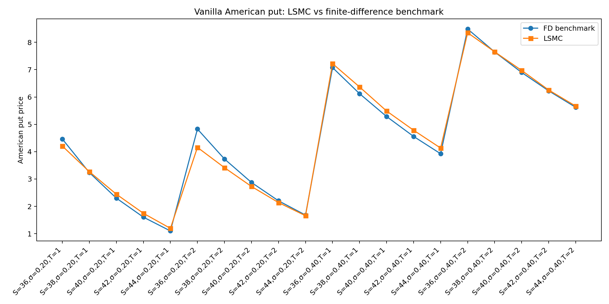
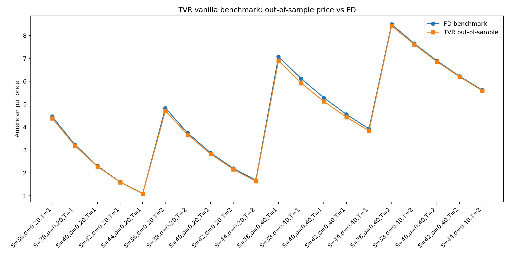
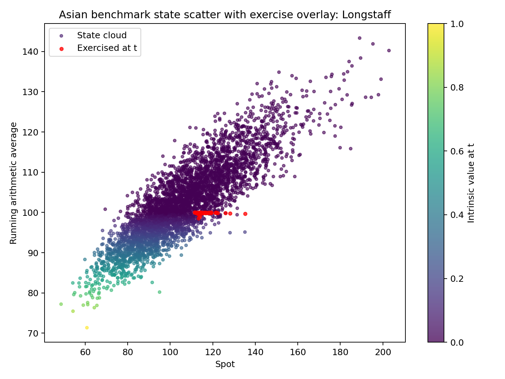
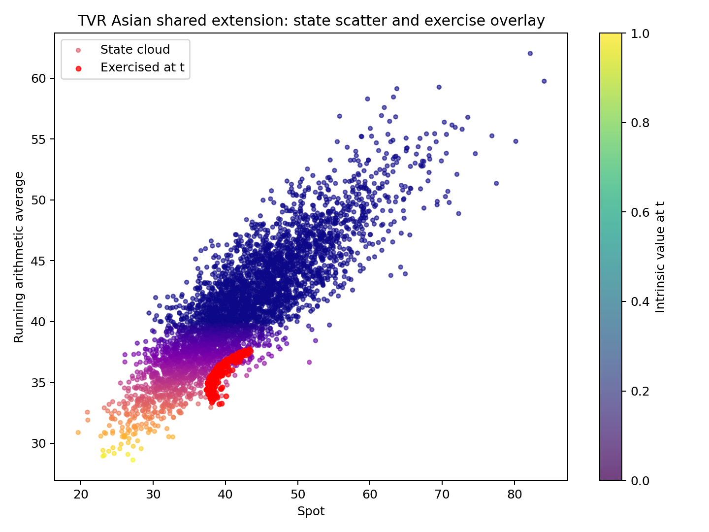
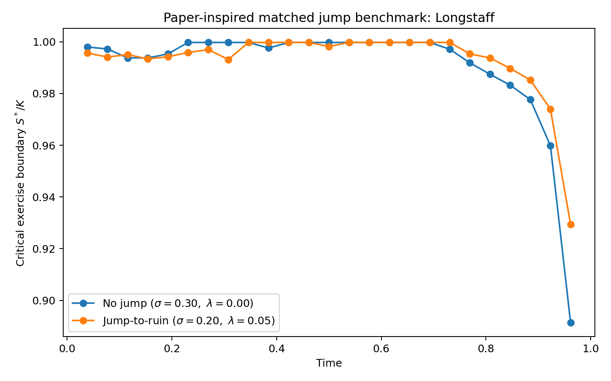
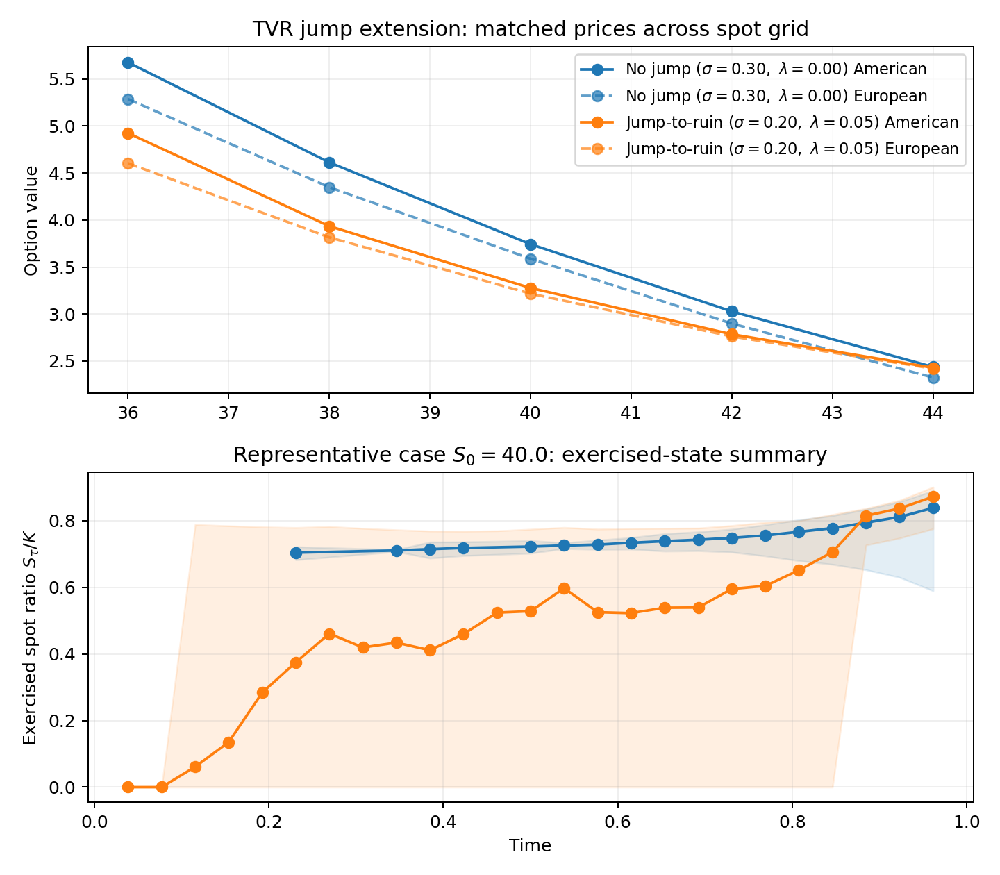

## From European to American: what changes?

A European option can only be exercised at maturity

Its value depends on a single terminal payoff expectation

An American option can be exercised before maturity

Valuation therefore becomes both:

  - a pricing problem
  - a decision problem

## American put pricing as an optimal stopping problem

We consider a vanilla American put with strike $K$ and maturity $T$

Under the risk-neutral measure, the holder chooses an admissible stopping time $\tau$

The time-0 value is

$$
V_0=\sup_{\tau\in\mathcal T}\mathbb E^{\mathbb Q}\left[e^{-r\tau}(K-S_\tau)^+\right]
$$

American option pricing is therefore an optimal stopping problem

## Bellman recursion: exercise vs continuation

At each exercise date, the option value satisfies

$$
V_i(S_{t_i})=\max\{h(S_{t_i}),C_i(S_{t_i})\}
$$

where

$$
h(S_{t_i})=(K-S_{t_i})^+
$$

and

$$
C_i(S_{t_i})=\mathbb E^{\mathbb Q}\left[e^{-r\Delta t}V_{i+1}(S_{t_{i+1}})\mid S_{t_i}\right]
$$

- The holder compares immediate exercise with continuation at each date

## What exactly is difficult to compute?

- The intrinsic value is easy to compute

- The main difficulty is the continuation value

- It is an unknown conditional expectation inside a backward recursion

- This is the computational issue that motivates the methods in the rest of the presentation

## Why this project matters

American option pricing is an **optimal stopping** problem. Need both:

  - a price,
  - an exercise rule.

Direct trees / PDE methods work well in **simple 1D settings**.

Richer contracts quickly create problems with:

  - larger state spaces,
  - path dependence,
  - changed dynamics.

This project studies two regression-based simulation methods under **one common design**.

**Goal:** compare methodology, not mismatched case studies.

## Longstaff--Schwartz Paper Walkthrough

Simulates risk-neutral paths and works backward from maturity

Estimates continuation values by least-squares regression

Regression target: discounted **realized future cash flows**

Exercises when intrinsic value exceeds fitted continuation value

Usually regresses only on **in-the-money** paths

## Tsitsiklis--Van Roy Paper Walkthrough

Treats the problem as approximate dynamic programming

Starts from the Bellman recursion and moves backward recursively

Approximates the value / continuation function with basis functions

Regression target: discounted **next-step estimated values**

Emphasizes approximation error and recursive stability

## Methods compared (Josh)

:::: {.columns}
::: {.column width="50%"}
**Longstaff--Schwartz (LSM)**

- Regress **discounted realized future cash flows**
- Builds a stopping rule from estimated continuation values
- Main practical pricing method in this project
:::

::: {.column width="50%"}
**Tsitsiklis--Van Roy (TVR)**

- Regress **discounted next-step estimated values**
- Fitted value iteration / approximate dynamic programming
- Matched comparator under the same testbeds
:::
::::

$$
V_i(s)=\max\{h(s),\;C_i(s)\}
$$

**Key difference:** same Bellman problem, different recursion target.

## Basis functions: how each method implements its regression (R.B)

:::: {.columns}
::: {.column width="50%"}
**Longstaff--Schwartz**

Approximates the **continuation value** $C_i(S_{t_i})$ using weighted Laguerre polynomials in normalised spot $X = S_t/K$:

$$L_0(X) = e^{-X/2}$$
$$L_1(X) = e^{-X/2}(1-X)$$
$$L_2(X) = e^{-X/2}(1 - 2X + X^2/2)$$

- Applied to **in-the-money paths only**
- Regression target: **realized future cash flows**
- Basis is well-matched to stock price distribution on $[0,\infty)$
:::

::: {.column width="50%"}
**Tsitsiklis--Van Roy**

Approximates the **value function** $\tilde{Q}(x,r) = \sum_k r_k \phi_k(x)$ using polynomial basis. What matters is the best approximation error:

$$\epsilon_n^* = \min_r \|\Phi r - Q_n\|_{\pi_n}$$

- Applied to **all paths**
- Regression target: **discounted next-step value estimate**
- Theory is agnostic about basis family --- quality determined by $\epsilon_n^*$
:::
::::

**Key difference:** LSM uses realized data; TVR carries forward fitted estimates.
Larger $\epsilon_n^*$ $\Rightarrow$ more error accumulation backward through time.

## Experimental Design: one benchmark layer, two extensions
The project is organized around three shared study layers motivated by corresponding examples in Longstaff–Schwartz paper.

**Main validation layer:** Vanilla American put under risk-neutral GBM

**Shared inputs:**

  - $K=40$, $r=0.06$
  - $S_0\in\{36,38,40,42,44\}$
  - $\sigma\in\{0.20,0.40\}$
  - $T\in\{1,2\}$
  - 50 exercise dates / year
  - 100,000 paths (50,000 base + 50,000 antithetic)

**Extensions:**

  - **Asian-style:** richer state vector $(S_t,A_t)$
  - **Jump-style:** changed simulator dynamics

## Benchmark hierarchy and implementation workflow
$$
\text{European BS lower reference}
\rightarrow
\text{Direct American benchmarks (FD, CRR)}
\rightarrow
$$
$$
\text{Longstaff / TVR}
\rightarrow
\text{Robustness + extensions}
$$

### Black–Scholes European Benchmark (Lower Reference)
The Black–Scholes European put provides a strict theoretical floor for the American option, as a non-dividend-paying American put cannot be worth less than its European equivalent. For spot $S_0$, strike $K$, volatility $\sigma$, risk-free rate $r$, and maturity $T$, the European price is:
$$
P_{\text{Euro}} = K e^{-rT} N(-d_2) - S_0 N(-d_1),
$$
where
$$
d_1 = \frac{\ln(S_0/K) + \left(r + \tfrac{1}{2}\sigma^2\right)T}{\sigma \sqrt{T}},
\qquad
d_2 = d_1 - \sigma \sqrt{T}.
$$
This serves as a lower reference to quantify the early-exercise premium ($P_{\text{American}} - P_{\text{Euro}}$), rather than as the primary benchmark itself.

## Implicit Finite-Difference Benchmark (Primary Reference)
The main direct benchmark is an implicit finite-difference solver, which directly evaluates the one-dimensional early-exercise problem on a discrete grid in stock price and time. The American put value $V(S,t)$ satisfies the Black–Scholes PDE in the continuation region:
$$
\frac{\partial V}{\partial t} + \frac{1}{2}\sigma^2 S^2 \frac{\partial^2 V}{\partial S^2} + rS \frac{\partial V}{\partial S} - rV = 0,
$$
subject to the terminal payoff $V(S,T) = (K-S)^+$ and the early-exercise constraint $V(S,t) \ge (K-S)^+$. The spatial and time derivatives are discretized to produce a linear system. Following the backward step, the numerical value is projected onto the intrinsic value:
$$
V_i^{n} = \max \bigl(V_i^{n,\text{cont}}, K-S_i\bigr),
$$
where $V_i^{n,\text{cont}}$ is the continuation value at node $(S_i,t_n)$.

## CRR Binomial Tree Benchmark (Auxiliary Check)
A Cox–Ross–Rubinstein (CRR) tree is included to ensure the internal coherence of the direct American benchmark layer. With time steps $\Delta t = T/N$, the stock moves are defined by $u = e^{\sigma \sqrt{\Delta t}}$ and $d = 1/u$, under the risk-neutral probability $p = \frac{e^{r\Delta t} - d}{u-d}$. The tree evaluates the terminal payoff $V_N(j) = (K - S_N(j))^+$ and is rolled backward via:
$$
C_n(j) = e^{-r\Delta t}\bigl(p V_{n+1}(j+1) + (1-p)V_{n+1}(j)\bigr),
$$
enforcing the early-exercise condition $V_n(j) = \max \bigl((K-S_n(j))^+, C_n(j)\bigr)$ at each node. 

##
Shared pieces wherever possible:

  - simulator,
  - basis construction,
  - benchmark logic.

Different pieces:

  - **LSM:** continuation-cash-flow regression,
  - **TVR:** fitted value recursion.

In both methods, the fitted policy is then evaluated on fresh paths.

**Why this matters:** same environment, different recursion logic.

## Vanilla benchmark: methods are sensible, but not interchangeable

```{=latex}
\begin{table}
\small
\centering
\begin{tabular}{lrrrr}
\toprule
Case & FD & LSMC (OOS) & TVR (OOS) & Pattern \\
\midrule
$S_0=36,\ \sigma=0.2,\ T=1$ & 4.463 & 4.206 & 4.385 & TVR closer \\
$S_0=40,\ \sigma=0.2,\ T=1$ & 2.299 & 2.444 & 2.278 & LSM high, TVR close \\
$S_0=40,\ \sigma=0.2,\ T=2$ & 2.873 & 2.727 & 2.829 & both reasonable \\
$S_0=40,\ \sigma=0.4,\ T=2$ & 6.897 & 6.971 & 6.859 & both close \\
$S_0=44,\ \sigma=0.4,\ T=1$ & 3.924 & 4.132 & 3.838 & LSM high, TVR low \\
\bottomrule
\end{tabular}%
\caption{Partial Results of Vanilla American put pricing comparison under different spot, volatility, and maturity settings.}
\end{table}
```

- Both methods produce **economically sensible American put values**.
- LSM can price **above or below** the FD benchmark.
- TVR tends to stay **near FD** and often slightly **below** it.

**Takeaway:** differences are methodological, not noise from different setups.

## Vanilla visuals: benchmark alignment

:::: {.columns}
::: {.column width="50%"}
{width=100%}

**LSM:** tighter than same-path pricing, but still case-dependent around FD.
:::

::: {.column width="50%"}
{width=100%}

**TVR:** clusters more closely around FD across the shared grid.
:::
::::

## Validation matters: same-path optimism is mainly a Longstaff issue

```{=latex}
\begin{table}
\small
\centering
\begin{tabular}{lrrr}
\toprule
Representative case & In-sample & Out-of-sample & Fit - Eval \\
\midrule
LSM: $S_0=36,\ \sigma=0.2,\ T=1$ & 4.452 & 4.206 & 0.247 \\
LSM: $S_0=40,\ \sigma=0.2,\ T=2$ & 3.060 & 2.739 & 0.321 \\
LSM: $S_0=40,\ \sigma=0.4,\ T=2$ & 7.810 & 6.956 & 0.854 \\
\midrule
TVR: $S_0=36,\ \sigma=0.2,\ T=1$ & 4.386 & 4.381 & 0.005 \\
TVR: $S_0=40,\ \sigma=0.2,\ T=2$ & 2.804 & 2.817 & -0.014 \\
TVR: $S_0=44,\ \sigma=0.4,\ T=1$ & 3.865 & 3.840 & 0.025 \\
\bottomrule
\end{tabular}%
\end{table}
```

- LSM shows **clear same-path optimism**.
- TVR fit/eval gaps are **much smaller**.

**Takeaway:** out-of-sample policy evaluation is not optional.

## Robustness snapshots

```{=latex}
\begin{table}
\small
\centering
\begin{tabular}{llrr}
\toprule
Test & Case & LSM pattern & TVR pattern \\
\midrule
Paths(25000 \to 200000) & $(40,0.2,1)$ & 2.317 \to 2.447 & 2.270 \to 2.282 \\
Paths(25000 \to 200000) & $(40,0.4,2)$ & 6.935 \to 6.958 & 6.889 \to 6.850 \\
Grid(Ex. Dates/Yr 25 \to 100) & $(40,0.2,1)$ & 2.561 \to 2.344 & 2.295 \to 2.281 \\
Grid(Ex. Dates/Yr 25 \to 100) & $(40,0.4,2)$ & 7.210 \to 6.827 & 6.864 \to 6.819 \\
Basis(2 \to 5) & $(40,0.2,1)$ & 2.385 \to 2.458 & 2.151 \to 2.285 \\
Basis(2 \to 5) & $(40,0.4,2)$ & 6.890 \to 6.992 & 6.466 \to 6.862 \\
\bottomrule
\end{tabular}
\caption{Partial Results of In-sample versus Out-of-sample Policy Valuation for Representative Vanilla American Put Cases}
\end{table}
```

- LSM is more sensitive to the interaction of fit and stopping-rule construction.
- TVR is more constrained by **under-parameterization** when the basis is too small.

## Robustness: what moves the price?

:::: {.columns}
::: {.column width="49%"}
**Longstaff**

- Path count reduces SE, but not monotone benchmark error
- Sensitive to exercise grid
- Sensitive to basis choice
- Seed variation is smaller than the main benchmark gaps
:::

::: {.column width="49%"}
**TVR**

- Also benefits from more paths
- More stable across path budgets
- More directional improvement with richer bases
- Still mildly conservative against FD
:::
::::

**Main message:** price quality depends on more than path count:

- basis design,
- exercise grid,
- validation structure,
- approximation target.

## Asian-style extension: American–Bermuda–Asian put
The state space is expanded to include both current spot and a running arithmetic average, with exercise restricted by a lockout period.

Under the risk-neutral measure, the stock follows GBM:
$$
dS_t = r S_t dt + \sigma S_t dW_t^{\mathbb Q},
$$

with constant r and $\sigma$. In the present Asian benchmark, the contract parameters are set to K = 100, r = 0.06, $\sigma = 0.20$, T = 2, with a lockout period of 0.25 years and 100 exercise dates per year in the discrete approximation. The same contract scope is used for both Longstaff and TVR.  

##
To reflect the paper’s idea that the average starts before valuation, we use a pre-started running arithmetic average:
$$
A_t = \frac{\delta A_0 + \int_0^t S_u,du}{\delta + t},
\qquad \delta = 0.25,
$$

where $A_0$ is the initial average level specified in the benchmark grid. In the code, this is the second state variable carried along each simulated path. 

The payoff from immediate exercise at time t is $h(S_t,A_t)=(K-A_t)^+,$ so this is an average-based put rather than a spot-based vanilla put. Exercise is not allowed before the lockout date $t_{\mathrm{lock}}=0.25$. The time-zero value is therefore

$$
V_0 = \sup_{\tau \in \mathcal T,\ \tau \ge t_{\mathrm{lock}}}
\mathbb E^{\mathbb Q} \left[e^{-r\tau}(K-A_\tau)^+\right].
$$

##
With exercise dates $(0=t_0<t_1<\cdots<t_N=T)$, the discrete-time Bellman recursion is
$$
V_i(s,a)
=
\max\left\{
(K-a)^+,\;
\mathbb{E}^{\mathbb{Q}}\!\left[
e^{-r\Delta t}V_{i+1}(S_{t_{i+1}},A_{t_{i+1}})
\mid S_{t_i}=s,\ A_{t_i}=a
\right]
\right\}.
$$

for dates after the lockout, with terminal condition $V_N(s,a)=(K-a)^{+}.$

**Purpose:** move from 1D vanilla validation to a richer continuation problem.

## Asian-style results: both methods work, policies differ

```{=latex}
\begin{table}
\small
\centering
\begin{tabular}{lrrrr}
\toprule
Representative case & LSM (OOS) & LSM Fit-Eval & TVR (OOS) & TVR - LSM \\
\midrule
$A_0=90,\ S_0=80$ & 13.777 & 1.016 & 17.498 & 3.720 \\
$A_0=100,\ S_0=100$ & 3.213 & 0.122 & 3.598 & 0.384 \\
$A_0=110,\ S_0=110$ & 1.066 & 0.068 & 1.078 & 0.013 \\
\bottomrule
\end{tabular}
\caption{Partial results on the paper-inspired $(A_0,S_0)$ grid with $K=100$, $r=0.06$, $\sigma=0.2$, $T=2$, lockout $=0.25$, and 100 exercise dates per year.}
\end{table}
```

- Both methods show the right comparative statics.

- LSM still has **positive fit-vs-eval gaps**.

- TVR is more **validation-stable** and often gives **higher values**.

**Interpretation:** multistate comparison only --- not a direct PDE benchmark exercise.

## Among all states the simulation visits at date t, where does the fitted policy choose to stop rather than continue?
Snapshot of T = 2, $A_0=S_0=100$ at t = 1. x-axis = Spot $S_t$, y-axis = Average $A_t$, the color bar is intrinsic value at time t

:::: {.columns}
::: {.column width="40%"}
{width=100%}

More exercise-prone in borderline states.
:::

::: {.column width="40%"}
{width=100%}

More continuation-oriented
:::
::::

## Jump-style extension: changed-dynamics study
The final layer replaces the standard GBM simulator with a stylized jump-to-ruin process.

Under the risk-neutral measure, we use a stylized jump-to-ruin process of the form
$$
dS_t = (r+\lambda)S_t dt + \sigma S_t dW_t^{\mathbb Q} - S_{t^-} dq_t,
$$

where $q_t$ is a Poisson process with intensity $\lambda$. When a jump occurs, the stock is sent to zero and remains there afterward. The $r+\lambda$ drift adjustment is the martingale correction used in the paper’s jump comparison. 

##
The immediate exercise payoff remains the vanilla American put payoff, $h(S_t) = (K-S_t)^+,$ so the time-zero value is
$$
V_0 = \sup_{\tau \in \mathcal T}
\mathbb E^{\mathbb Q} \left[e^{-r\tau}(K-S_\tau)^+\right].
$$

With exercise dates $0=t_0<t_1<\cdots<t_N=T$, the discrete-time Bellman recursion is
$$
V_i(s)=
\max\left\{
(K-s)^+,\;
\mathbb{E}^{\mathbb{Q}}\!\left[
e^{-r\Delta t} V_{i+1}(S_{t_{i+1}})
\,\middle|\, S_{t_i}=s
\right]
\right\}.
$$

We compare two cases with the same strike and maturity, K = 40, r = 0.06, T = 1, using 26 exercise dates per year:

* **no jump:** $\lambda=0, \sigma=0.30$
* **jump-to-ruin:** $\lambda=0.05, \sigma=0.20$.

**Purpose:** test whether both methods remain coherent when dynamics change.

## Jump-style results: changed dynamics, same methodological contrast

```{=latex}
\begin{table}
\small
\centering
\begin{tabular}{lrrrr}
\toprule
Case at $S_0=40$ & American & Euro MC & Premium & Fit-Eval \\
\midrule
LSM no-jump & 4.093 & 3.570 & 0.523 & 0.235 \\
LSM jump-to-ruin & 3.614 & 3.220 & 0.394 & 0.149 \\
TVR no-jump & 3.743 & 3.588 & 0.155 & 0.001 \\
TVR jump-to-ruin & 3.277 & 3.217 & 0.060 & -0.020 \\
\bottomrule
\end{tabular}
\caption{Partial results on the matched jump grid with $K=40$, $r=0.06$, $T=1$, 26 exercise dates per year, and 50{,}000 total paths. The no-jump case uses $\sigma=0.30,\ \lambda=0.00$, while the jump-to-ruin case uses $\sigma=0.20,\ \lambda=0.05$.}
\end{table}
```

- Across the full jump grid, values fall with spot in both model cases.

- American values remain above European MC values.

- In this matched design, **jump-to-ruin values are generally lower** than no-jump values.

- TVR remains more conservative than LSM.

## Jump-style visuals: price ranking + exercised-state summary

:::: {.columns}
::: {.column width="50%"}
{width=100%}

**LSM:** coherent under changed dynamics, but more exercise-prone.
:::

::: {.column width="50%"}
{width=100%}

**TVR:** same ranking, more selective exercise; smaller fit/eval gap
:::
::::

## Direct Longstaff vs TVR comparison (R.B)

:::: {.columns}
::: {.column width="50%"}
**Longstaff--Schwartz**

- More directly tied to stopping-rule construction
- Strong practical simulation method
- More sensitive to:

  - fit/eval separation,
  - basis design,
  - exercise-grid design
- Can look optimistic if only same-path values are reported
:::

::: {.column width="50%"}
**Tsitsiklis--Van Roy**

- More naturally read as fitted value iteration
- More stable under matched out-of-sample evaluation
- Often mildly conservative in benchmark alignment
- More continuation-oriented in the extensions
:::
::::

**Bottom line:** same optimal stopping problem, different numerical behavior.

## Convergence theory: why the two methods behave differently (R.B)

**LSM: Proposition 1 (downward bias)**

$$V(X) \geq \lim_{N\to\infty} \frac{1}{N}\sum_{i=1}^N \text{LSM}(\omega_i; M, K)$$

LSM produces a stopping rule --- asymptotically never overstates true value.
But in finite samples with a finite basis, prices can sit above or below a numerical benchmark.
The large fit/eval gaps in our results confirm that same-path evaluation overstates performance.

## 
**TVR: Theorem 1 (bounded error under trajectory sampling)**

$$\tilde{e}_n^2 \leq \alpha^2 \tilde{e}_{n+1}^2 + (\epsilon_n^*)^2$$

If states are sampled from the risk-neutral trajectory distribution, error is bounded:

$$\tilde{e}_n \leq \frac{\epsilon}{\sqrt{2(1-\alpha^2)}} \quad \textbf{independent of } N$$

Without trajectory sampling, errors grow **exponentially** with horizon.

##
**TVR: Theorem 2 (almost sure convergence)**

$$\hat{r}_n(m) \xrightarrow{a.s.} r_n \quad \text{as } m \to \infty$$

Sample-based regression converges to the idealised algorithm as paths grow.

**This explains our results:** TVR's small fit/eval gaps reflect bounded error accumulation.
LSM's large gaps reflect in-sample optimism that out-of-sample evaluation corrects.
Our basis sensitivity tables show $\epsilon_n^*$ shrinking as basis grows --- exactly as Theorem 1 predicts.

## Implementation Scope and Claims

The project does **not** claim strict numerical convergence proofs. Instead, it uses the papers' ideas to motivate a careful empirical workflow:

  - direct benchmarking where possible,
  - independent policy evaluation,
  - matched testbeds across methods,
  - robustness checks when approximation design matters.

Vanilla is the main validation layer.

Asian and jump are extension layers for:

  - richer state representation,
  - changed dynamics,
  - workflow flexibility.

**Testing claim:** not production pricing --- but defensible implementation evidence.

## Limitations of the methods

**GBM assumption:**

  - Constant volatility --- real equity vol clusters and smiles
  - No dividends --- matters for equity options in practice
  - Lognormal returns --- fat tails and skew ignored
  - Constant risk-free rate --- unrealistic for long maturities

**LSM method:**

  - Basis choice directly affects approximation quality
  - In-sample optimism --- same-path pricing overstates performance
  - Finite paths leave residual Monte Carlo noise

**TVR comparator:**

  - Polynomial basis has larger $\epsilon_n^*$ than Laguerre basis
  - All-path regression dilutes approximation in the ITM region
  - Error accumulates backward through the recursion

**Common to both:** no implied vol calibration, no dividend adjustment.


## Final takeaways (Josh)

Regression-based American pricing is **flexible and useful**.

But the output depends on more than simulation size:

  - basis design,
  - state representation,
  - exercise grid,
  - validation structure.

Longstaff and TVR are **not numerically interchangeable**.

Under the shared design here:

  - **LSM** is more directly tied to practical stopping-rule construction,
  - **TVR** is more validation-stable and mildly conservative.

## Main conclusions

Regression-based methods are effective for pricing American-style options
But pricing quality depends on more than simulation size
Important design choices include:

  - basis functions
  - state representation
  - exercise grid
  - out-of-sample validation

Under a shared benchmark design, Longstaff and TVR are not numerically interchangeable

## References

Longstaff, F. A., & Schwartz, E. S. (2001). *Valuing American options by simulation: A simple least-squares approach.*

Tsitsiklis, J. N., & Van Roy, B. (2001). *Regression methods for pricing complex American-style options.*
