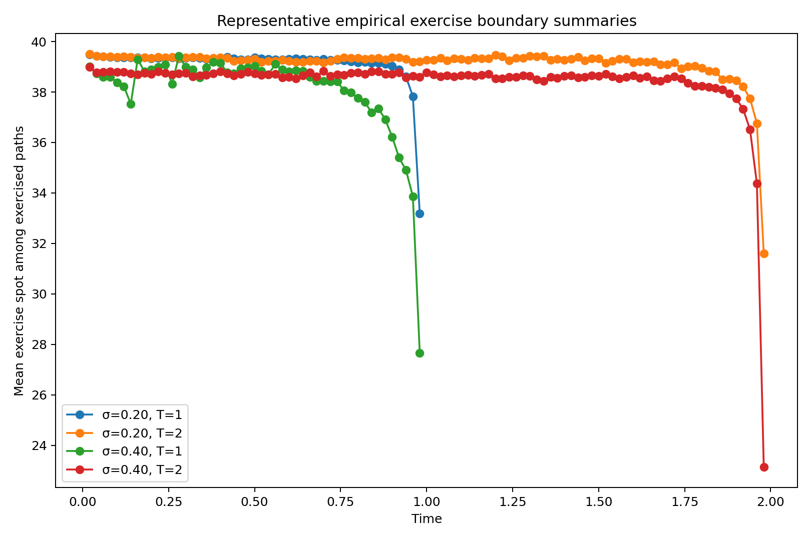

```{python}
import pandas as pd
from IPython.display import Markdown, display

longstaff_vanilla = pd.read_csv('../outputs/longstaff_vanilla_benchmark.csv')
longstaff_inout = pd.read_csv('../outputs/longstaff_vanilla_in_vs_out_sample.csv')
longstaff_paths = pd.read_csv('../outputs/longstaff_vanilla_paths_sensitivity.csv')
longstaff_timestep = pd.read_csv('../outputs/longstaff_vanilla_timestep_sensitivity.csv')
longstaff_basis = pd.read_csv('../outputs/longstaff_vanilla_basis_sensitivity.csv')
longstaff_seed = pd.read_csv('../outputs/longstaff_vanilla_seed_sensitivity.csv')
longstaff_asian = pd.read_csv('../outputs/longstaff_asian_results.csv')
longstaff_jump = pd.read_csv('../outputs/longstaff_jump_results.csv')

tvr_vanilla = pd.read_csv('../outputs/tvr_vanilla_benchmark.csv')
tvr_inout = pd.read_csv('../outputs/tvr_vanilla_in_vs_out_sample.csv')
tvr_paths = pd.read_csv('../outputs/tvr_vanilla_paths_sensitivity.csv')
tvr_timestep = pd.read_csv('../outputs/tvr_vanilla_timestep_sensitivity.csv')
tvr_basis = pd.read_csv('../outputs/tvr_vanilla_basis_sensitivity.csv')
tvr_asian = pd.read_csv('../outputs/tvr_asian_results.csv')
tvr_jump = pd.read_csv('../outputs/tvr_jump_results.csv')

longstaff_seed_runs = longstaff_seed[longstaff_seed['seed'] != 'summary'].copy()
longstaff_seed_summary = longstaff_seed[longstaff_seed['seed'] == 'summary'].copy()
longstaff_seed_summary['case'] = (
    'S=' + longstaff_seed_summary['spot'].astype(str)
    + ', σ=' + longstaff_seed_summary['sigma'].astype(str)
    + ', T=' + longstaff_seed_summary['maturity'].astype(str)
)


def render_results_table(df, *, label, caption, columns=None, rename_map=None, digits=4):
    tbl = df.copy()
    if columns is not None:
        tbl = tbl[columns].copy()
    if rename_map is not None:
        tbl = tbl.rename(columns=rename_map)
    num_cols = tbl.select_dtypes(include=['number']).columns
    tbl[num_cols] = tbl[num_cols].round(digits)
    latex = tbl.to_latex(index=False, escape=False, na_rep='', column_format='l' + 'r' * (len(tbl.columns) - 1))
    wrapped = (
        f"\\begin{{table}}[H]\n"
        f"\\centering\n"
        f"\\small\n"
        f"\\resizebox{{\\textwidth}}{{!}}{{%\n"
        f"{latex.rstrip()}\n"
        f"}}\n"
        f"\\caption{{{caption}}}\n"
        f"\\label{{{label}}}\n"
        f"\\end{{table}}"
    )
    display(Markdown(f"```{{=latex}}\n{wrapped}\n```"))
```

\newpage

## Introduction

American option pricing is fundamentally an optimal stopping problem. Unlike a European claim, an American contract can be exercised prior to maturity, so valuation requires not only a price but also a rule describing when exercise is optimal. This feature makes American-style derivatives substantially more difficult to value than European derivatives. Even in the simple case of a vanilla American put under geometric Brownian motion, valuation cannot be reduced to a single terminal expectation, because the holder must repeatedly compare the payoff from immediate exercise with the value of waiting.

This report studies that problem through two influential simulation-based papers. Longstaff and Schwartz (2001) develop the least-squares Monte Carlo approach, whose key idea is to estimate the conditional expected payoff from continuation by least-squares regression on simulated paths. Their method is motivated by the observation that, at each exercise date, the optimal decision depends on comparing immediate exercise value with the conditional expectation of future discounted cash flows from continuation. By estimating that conditional expectation from cross-sectional path information, the method converts a difficult optimal stopping problem into a sequence of regression problems. 

Tsitsiklis and Van Roy (2001) study the same class of American-style pricing problems from the viewpoint of approximate dynamic programming. Their framework starts from the Bellman recursion and emphasizes recursive approximation of the value function over a parameterized function class. In this formulation, the central issue is not only how to estimate continuation values, but also how approximation error propagates backward through time. The paper shows that naive approximation schemes can generate errors that grow rapidly with the horizon, while trajectory-based sampling under the risk-neutral distribution yields a much more stable approximation framework. 

The two papers therefore address the same computational challenge but from different angles. Longstaff--Schwartz is more directly tied to continuation-value regression and practical pathwise stopping-rule construction, whereas Tsitsiklis--Van Roy is more explicitly framed in terms of value iteration, projection, and approximation error control. In the present project, Longstaff--Schwartz is treated as the main practical pricing method, and Tsitsiklis--Van Roy is implemented as a matched comparator under the same computational testbeds. This shared design allows differences in the results to be interpreted as methodological differences rather than differences in case construction. 

The empirical study is organized around a shared synthetic benchmark rather than historical equity calibration. The main benchmark is a vanilla American put under risk-neutral geometric Brownian motion, priced against an implicit finite-difference American benchmark, a Black--Scholes European lower reference, and a CRR tree check. This shared benchmark is then extended in two directions: an Asian-style extension with multiple state variables and a jump-style extension showing how both regression methods behave when the state dynamics change.

The purpose of the project is to study the two papers with implementation evidence, testing, and critical assessment. It is not a claim of exact numerical reproduction of every published table. The emphasis is on understanding the pricing logic, implementing it in a coherent way, and comparing the two approaches under a common design.

## Problem setup: American option pricing as an optimal stopping problem

Let $(\Omega,\mathcal{F},\mathbb{Q})$ be a risk-neutral probability space equipped with a filtration $(\mathcal{F}_t)_{0\le t\le T}$ generated by the relevant state variables of the pricing model. For an American put with strike $K$ and maturity $T$ written on an underlying process $(S_t)_{0\le t\le T}$, the holder may choose an admissible stopping time $\tau$ taking values in $[0,T]$. Under no-arbitrage pricing, the time-zero value is

$$
V_0 = \sup_{\tau \in \mathcal{T}} \mathbb{E}^{\mathbb{Q}}\left[e^{-r\tau}(K-S_\tau)^+\right],
$$

where $r$ is the continuously compounded risk-free rate and $\mathcal{T}$ is the set of stopping times with respect to the filtration. This formulation makes clear that American option valuation is not only a pricing problem but also a decision problem: one must determine the exercise rule that maximizes expected discounted payoff. This is the standard optimal stopping representation underlying both Longstaff--Schwartz and Tsitsiklis--Van Roy. 

In practice, numerical valuation is usually carried out in discrete time. If the allowable exercise dates are
$$
0=t_0<t_1<\cdots<t_N=T,
$$
then the American option is approximated by a Bermudan option that may only be exercised on this grid. This restriction slightly lowers the value relative to the continuous-time contract, but under standard regularity conditions the approximation improves as the exercise mesh becomes finer. Tsitsiklis and Van Roy explicitly adopt this discrete-time setup in order to formulate the pricing problem through dynamic programming, and Longstaff--Schwartz likewise implement their simulation method on a finite exercise grid. 

Under this discrete-time formulation, the Bellman recursion is
$$
V_i(S_{t_i}) = \max\left\{ h(S_{t_i}),\; C_i(S_{t_i}) \right\},
$$
where
$$
h(S_{t_i})=(K-S_{t_i})^+
$$
is the intrinsic value and
$$
C_i(S_{t_i}) = \mathbb{E}^{\mathbb{Q}}\left[e^{-r\Delta t}V_{i+1}(S_{t_{i+1}})\mid S_{t_i}\right]
$$
is the continuation value. The continuation term is the conditional expected discounted value of waiting one more step and then acting optimally thereafter. American pricing therefore requires repeated comparison of immediate exercise and continuation value at every exercise date.

This recursion also explains why American option pricing is much harder than European pricing. For a European option, valuation reduces to one terminal expectation under the risk-neutral measure. For an American option, the continuation value itself is an unknown conditional expectation embedded inside a backward recursion with a max operator. In low-dimensional settings, this recursion can be handled directly by trees or finite-difference methods. In higher-dimensional settings, however, explicit state-space discretization becomes computationally prohibitive. The contribution of both Longstaff--Schwartz and Tsitsiklis--Van Roy is to replace dense state-space discretization with regression-based approximations built from simulated paths. 

For the purposes of this study, this setup also clarifies the methodological difference between the two papers. Longstaff and Schwartz approximates the continuation value by regressing discounted realized future cash flows on basis functions of the current state. Tsitsiklis and Van Roy instead frame the problem as approximate value iteration and recursively approximate the value function, or equivalently the continuation component, through projection onto a finite-dimensional approximation space. Both methods start from the same Bellman optimal-stopping logic, but they differ in what is being approximated and therefore in how benchmark alignment, out-of-sample behavior, and approximation error are interpreted in the report.

## Longstaff--Schwartz (2001): paper walkthrough and intuition

Longstaff and Schwartz (2001) address the main difficulty in simulation-based American pricing: simulation is well suited to terminal expected values, but American-style claims require continuation values and exercise decisions at intermediate dates. Their key idea is that the conditional expected payoff from continuation can be estimated from the cross-sectional information in simulated paths by least-squares regression. 

At an exercise date $t_i$, the continuation value is approximated by
$$
C_i(S_{t_i}) \approx \hat{C}_i(S_{t_i}) = \sum_{j=0}^{m}\beta_{i,j}\psi_j(S_{t_i}),
$$
where $\{\psi_j\}$ is a chosen basis. In the vanilla American put example, Longstaff--Schwartz use a constant together with low-order weighted Laguerre polynomials, motivated by the fact that the continuation value is a conditional expectation and can be approximated by projection onto a finite-dimensional basis. 

The algorithm proceeds backward. First, simulate risk-neutral paths and initialize the option payoff at maturity. Then, moving backward through the exercise dates, regress discounted realized future cash flows on basis functions of the current state. This fitted value is used as an estimate of the continuation value. The holder exercises whenever the intrinsic value exceeds the fitted continuation value, and otherwise continues. The important point is that the regression target is not the next-step intrinsic payoff, but the discounted realized cash flow generated by continuing and then following the estimated stopping policy thereafter. 

A practical feature of the method is that the regression is carried out only on in-the-money paths. The reason is that the exercise decision is economically relevant only in that region. Longstaff and Schwartz argue that restricting the regression to in-the-money states improves efficiency because the conditional expectation does not need to be approximated accurately in regions where immediate exercise is impossible anyway. 

A useful theoretical interpretation of the method is that any fixed finite basis and exercise design produces a particular stopping rule. The resulting price is therefore the value of that rule rather than the unknown true American value itself. This helps explain why the method is often described as having a lower-bound logic asymptotically, but also why finite-sample implementations need not lie below every numerical benchmark in every case. Later convergence results, such as Stentoft (2004), make clear that consistency of the LSM estimator requires attention not only to the number of simulated paths but also to the richness of the approximation space. 

## Tsitsiklis--Van Roy (2001): paper walkthrough and intuition

Tsitsiklis and Van Roy (2001) study American-style option pricing as a finite-horizon optimal stopping problem solved by approximate dynamic programming. Their starting point is the discrete-time Bellman recursion, but instead of computing the value function exactly over the full state space, they work within a finitely parameterized approximation class and update the approximation recursively backward through time. This makes the method suitable for complex American-style claims with possibly high-dimensional state spaces. 

In their framework, the continuation or value function is approximated by projection onto a finite-dimensional basis,
$$
\hat{C}_i(s) = \sum_{j=0}^{m}\alpha_{i,j}\phi_j(s),
$$
and the approximate value recursion is written as
$$
\hat{V}_i(s) = \max\{h(s), \hat{C}_i(s)\}.
$$
The key difference from Longstaff--Schwartz is that the regression target is based on discounted next-step estimated values, not discounted realized future cash flows. In this sense, TVR is closer to fitted value iteration than to direct continuation-cash-flow regression. 

A central concept in the paper is the use of representative states. The regressions are carried out not over the entire state space, but at a finite sample of states, and the resulting fitted function is used to approximate values elsewhere. The paper shows that this design choice matters greatly. If representative states are chosen arbitrarily, approximation error can grow rapidly with the time horizon. By contrast, if they are generated by simulating the state process under the risk-neutral distribution, the approximation error remains controlled. This result is one of the main theoretical motivations for trajectory-based regression methods. 

Another important feature of the paper is its explicit emphasis on approximation error. The relevant question is not whether one has chosen a particular named polynomial family, but whether the selected approximation space can represent the true continuation structure well over the region of the state space actually visited by simulated paths. This is why the paper frames the method in terms of projection error and recursive error propagation rather than only in terms of regression fit at a single date. 

In the present project, TVR is implemented under the same shared testbeds as Longstaff--Schwartz so that differences in the results can be interpreted as differences in recursion logic rather than differences in model environment. The practical output is again a stopping policy, but the conceptual route is different: Longstaff estimates continuation from realized future payoffs, whereas TVR recursively approximates the value function itself. 

## Conceptual Comparison of the Two Papers

The two papers solve closely related American-style pricing problems, but they do so through different approximation targets. Longstaff--Schwartz estimate continuation values by regressing discounted realized future cash flows on functions of the current state and then infer a stopping rule from that comparison. Tsitsiklis--Van Roy instead use discounted next-step estimated values and frame the problem more explicitly as approximate dynamic programming. In both cases, the underlying Bellman logic is the same, but the recursion target is different. 

This distinction matters for interpretation. In Longstaff--Schwartz, the regression is tied directly to the realized payoff from continuation along simulated paths, so the method is naturally read as a continuation-regression approach. In Tsitsiklis--Van Roy, the emphasis is on recursively approximating the value function over a finite-dimensional approximation space, so the method is more naturally read as fitted value iteration. The two approaches therefore differ not only computationally, but also conceptually in how they describe the role of regression in the stopping problem. 

In this project, Longstaff--Schwartz serves as the main empirical pricing procedure and Tsitsiklis--Van Roy serves as a matched comparator under the same benchmark design. The comparison is therefore methodological: both methods face the same simulated states, exercise grids, payoff structures, and benchmark references, but differ in recursion logic and approximation target. 

### Basis Functions and Approximation Viewpoint

Both papers require approximation of a continuation-related function at each backward time step using a finite set of basis functions. Basis choice is therefore a substantive modeling decision rather than a cosmetic implementation detail. It affects approximation quality, numerical stability, and the behavior of the implied stopping rule. The two papers, however, motivate the role of basis functions somewhat differently. Longstaff--Schwartz present basis functions mainly as a practical way to estimate continuation values accurately enough for exercise decisions, whereas Tsitsiklis--Van Roy place more emphasis on projection error and on how well the chosen approximation space represents the relevant value function over the state distribution induced by the model. 

#### Basis Functions in Longstaff--Schwartz (2001)
In the Longstaff--Schwartz framework, basis functions are used to approximate the conditional expectation of continuation value at each exercise date. For the vanilla American put, the paper uses a constant together with the first three weighted Laguerre polynomials in normalized spot, where
$$
X = \frac{S_t}{K}.
$$
The first three weighted Laguerre terms are
$$
L_0(X) = e^{-X/2},
$$
$$
L_1(X) = e^{-X/2}(1 - X),
$$
$$
L_2(X) = e^{-X/2}\left(1 - 2X + \frac{X^2}{2}\right).
$$
The continuation function is then approximated by a linear combination of basis terms,
$$
F(\omega; t_k) \approx \sum_{j=0}^{M} a_j \psi_j(X),
$$
with coefficients estimated by least squares on the relevant simulated paths. In the vanilla benchmark, this basis is applied to in-the-money paths because those are the states for which the exercise decision is economically active.

For higher-dimensional examples, Longstaff and Schwartz expand the basis to reflect the richer state vector. In the American--Bermuda--Asian setting, for example, the continuation value depends not only on current spot but also on the running average, so the basis must incorporate functions of both state variables and their interactions. This is directly relevant to the project’s Asian-style extension, where the move from a one-state vanilla benchmark to a two-state continuation problem is one of the main methodological motivations.

A useful empirical point in Longstaff--Schwartz is that pricing accuracy in simple settings is often not very sensitive to the precise orthogonal family used, provided the basis is rich enough to approximate the continuation function reasonably well. The paper reports that Laguerre polynomials, ordinary powers, Hermite polynomials, and trigonometric functions can all give very similar vanilla-put prices. The practical lesson is not that basis choice is irrelevant, but that in smooth low-dimensional problems several reasonable low-order bases may work similarly well. At the same time, the paper warns that poor scaling and near-singular regression matrices can still create numerical instability, which is why normalizing the state variable by strike is a sensible implementation choice.

#### Basis Functions in Tsitsiklis--Van Roy (2001)

In the Tsitsiklis--Van Roy framework, basis functions play a closely related but more explicitly theoretical role. Rather than directly approximating realized continuation cash flows, the method parameterizes the continuation or value function as a linear combination of basis elements,
$$
\tilde{Q}(x, r) = \sum_{k=1}^{K} r_k \phi_k(x) = (\Phi r)(x),
$$

where $\phi_1, \ldots, \phi_K$ are fixed basis functions and $r \in \mathbb{R}^K$ is the regression parameter vector. What matters in the TVR analysis is not a particular polynomial family by name, but how well the chosen finite-dimensional space can approximate the true continuation function under the relevant state distribution.

This idea is summarized by the best approximation error
$$
\epsilon_n^* = \min_r \|\Phi r - Q_n\|_{\pi_n}
= \|\Pi_n Q_n - Q_n\|_{\pi_n},
$$

where $\pi_n$ is the distribution of representative states at time step $n$. In the TVR framework, the quality of the algorithm depends on keeping this approximation error controlled through the backward recursion. The theoretical emphasis is therefore less on a named basis family and more on whether the chosen basis captures the relevant continuation structure over the state region visited by simulated paths.

This perspective is useful for the present project because it clarifies why basis design should be treated as a substantive modeling choice rather than a cosmetic implementation detail. In the shared vanilla benchmark, both Longstaff and TVR are intentionally run with matched approximation complexity so that the comparison is not driven by one method being given a systematically richer function class than the other. In the Asian-style extension, both methods move from a one-state to a two-state continuation problem, and the basis must expand accordingly to reflect the richer state vector. The practical question is therefore not whether one paper prescribes a universally superior polynomial family, but whether the chosen basis is rich enough to approximate continuation well while remaining numerically stable under the simulated trajectory distribution.

Overall, the two papers offer complementary viewpoints on basis selection. Longstaff--Schwartz shows empirically that several reasonable low-order bases can perform similarly in simple problems, while Tsitsiklis--Van Roy explains theoretically that what ultimately matters is the projection error induced by the chosen approximation space. Read together, they support the design logic of the present study: use a shared benchmark environment, keep basis complexity comparable across methods, and then examine through robustness analysis how pricing performance reacts to basis choice, validation design, and state-space complexity.

## Risk-neutral Benchmark Environment and Study Scope
The project uses a standard geometric Brownian motion (GBM) environment under the risk-neutral measure:
$$
dS_t = rS_t\,dt + \sigma S_t\,dW_t^{\mathbb{Q}},
$$
with constant volatility $\sigma$ and no dividends. In discrete time, this is simulated as:
$$
S_{t+\Delta t} = S_t \exp\left((r-\frac{1}{2}\sigma^2)\Delta t + \sigma\sqrt{\Delta t}Z\right), \qquad Z\sim N(0,1).
$$

This baseline is chosen to provide a common, one-dimensional testbed under which both Longstaff–Schwartz and Tsitsiklis–Van Roy can be objectively compared against direct American pricing methods. Because the primary objective of this report is a methodological comparison rather than market calibration, relying on a shared synthetic benchmark is more rigorous than a historical calibration exercise. 

The synthetic grid across both methods is defined as follows:

* Strike $K=40$
* Risk-free rate $r=0.06$
* Initial spot $S_0 \in \{36,38,40,42,44\}$
* Volatility $\sigma \in \{0.20,0.40\}$
* Maturity $T \in \{1,2\}$ years
* Exercise frequency: 50 dates per year
* Simulation budget: 100,000 total paths (50,000 base + 50,000 antithetic)

While both the Longstaff–Schwartz and Tsitsiklis–Van Roy frameworks are designed to handle complex, path-dependent, and high-dimensional state spaces, the GBM setting is a deliberate baseline to cleanly evaluate the two methods before moving to richer extensions.

## Experimental Design
To evaluate the two regression frameworks under a common computational design, the study is organized into three linked layers: a shared vanilla benchmark, an Asian-style multistate extension, and a jump-style changed-dynamics extension. This hierarchy is motivated by the vanilla American put, Asian-Bermudan, and jump-diffusion examples in Longstaff–Schwartz paper, but is implemented here as one matched study so that differences between Longstaff and TVR can be interpreted as methodological rather than contractual.

1.  **Shared Vanilla Benchmark (Direct Validation):** The first layer evaluates the vanilla American put under the risk-neutral GBM setup. This serves as the core validation exercise, directly comparing the regression-based simulation values against a numerical finite-difference benchmark. Robustness analysis is concentrated in this layer to test the sensitivity of both methods to path counts, exercise grids, basis specification, and in-sample versus out-of-sample valuation.

2.  **Asian-Style Extension (Multistate):** Motivated by Longstaff and Schwartz's path-dependent examples, this layer extends the contract to an American–Bermuda–Asian put. The state space is expanded to include both current spot and a running arithmetic average, with exercise restricted by a lockout period. This transitions the study from a one-dimensional problem to a setting where continuation regression becomes genuinely multivariate, demonstrating the comparative advantage of simulation methods.

3.  **Jump-Style Extension (Changed Dynamics):** The final layer replaces the standard GBM simulator with a stylized jump-to-ruin process. This isolates model flexibility: the regression-and-backward-induction architecture remains intact while the state dynamics are fundamentally altered. 

The experimental hierarchy can be summarized as:
$$
\text{European Black-Scholes} \longrightarrow \text{Direct American Benchmarks (FD, CRR)} \longrightarrow 
$$
$$
\text{Regression Methods(Longstaff, TVR)} \longrightarrow \text{Robustness \& Extensions}
$$

## Benchmark Pricing Framework

In the vanilla study, regression methods are anchored against three mathematical benchmarks to contextualize the pricing outputs. 

### Black–Scholes European Benchmark (Lower Reference)
The Black–Scholes European put provides a strict theoretical floor for the American option, as a non-dividend-paying American put cannot be worth less than its European equivalent. For spot $S_0$, strike $K$, volatility $\sigma$, risk-free rate $r$, and maturity $T$, the European price is:
$$
P_{\text{Euro}} = K e^{-rT} N(-d_2) - S_0 N(-d_1),
$$
where
$$
d_1 = \frac{\ln(S_0/K) + \left(r + \tfrac{1}{2}\sigma^2\right)T}{\sigma \sqrt{T}},
\qquad
d_2 = d_1 - \sigma \sqrt{T}.
$$
This serves as a lower reference to quantify the early-exercise premium ($P_{\text{American}} - P_{\text{Euro}}$), rather than as the primary benchmark itself.

### Implicit Finite-Difference Benchmark (Primary Reference)
The main direct benchmark is an implicit finite-difference solver, which directly evaluates the one-dimensional early-exercise problem on a discrete grid in stock price and time. The American put value $V(S,t)$ satisfies the Black–Scholes PDE in the continuation region:
$$
\frac{\partial V}{\partial t} + \frac{1}{2}\sigma^2 S^2 \frac{\partial^2 V}{\partial S^2} + rS \frac{\partial V}{\partial S} - rV = 0,
$$
subject to the terminal payoff $V(S,T) = (K-S)^+$ and the early-exercise constraint $V(S,t) \ge (K-S)^+$. The spatial and time derivatives are discretized to produce a linear system. Following the backward step, the numerical value is projected onto the intrinsic value:
$$
V_i^{n} = \max \bigl(V_i^{n,\text{cont}}, K-S_i\bigr),
$$
where $V_i^{n,\text{cont}}$ is the continuation value at node $(S_i,t_n)$.

### CRR Binomial Tree Benchmark (Auxiliary Check)
A Cox–Ross–Rubinstein (CRR) tree is included to ensure the internal coherence of the direct American benchmark layer. With time steps $\Delta t = T/N$, the stock moves are defined by $u = e^{\sigma \sqrt{\Delta t}}$ and $d = 1/u$, under the risk-neutral probability $p = \frac{e^{r\Delta t} - d}{u-d}$. The tree evaluates the terminal payoff $V_N(j) = (K - S_N(j))^+$ and is rolled backward via:
$$
C_n(j) = e^{-r\Delta t}\bigl(p V_{n+1}(j+1) + (1-p)V_{n+1}(j)\bigr),
$$
enforcing the early-exercise condition $V_n(j) = \max \bigl((K-S_n(j))^+, C_n(j)\bigr)$ at each node. 

## Integrated Implementation Workflow and Code Design

The computational pipeline is structured as a single, unified pricing study utilizing two distinct regression engines. To ensure differences in output stem purely from recursion logic, basis construction, simulation paths, and direct benchmarking are strictly shared.

1.  **Matched Approximation:** The vanilla layer uses a one-state basis of weighted Laguerre polynomials in normalized spot, while the Asian extension expands to a two-state basis capturing current spot, running average, and their interaction terms.

2.  **Shared Simulation Generators:** Both methods utilize identical underlying path generators: antithetic GBM for the vanilla layer, augmented spot-average mechanics for the Asian extension, and a stylized jump-to-ruin process for the final extension. 

3.  **Differentiated Recursion Logic:**  
    * The **Longstaff engine** executes backward induction by regressing discounted realized continuation cash flows on in-the-money paths.
    * The **TVR engine** utilizes fitted value iteration, regressing discounted next-step estimated values across current-state basis functions.

4.  **Out-of-Sample Evaluation:** For both algorithms, the fitted regression rule generates an implied stopping policy that is subsequently evaluated on an independent, out-of-sample path set to strip away same-path fitting optimism. 

The resulting workflow follows a strict sequential logic: define the shared synthetic inputs, establish the deterministic FD/CRR/BS benchmark layer, run both simulated regression engines on identical paths, and finally analyze the methodological divergence in their stopping policies.

## Results
### Shared Vanilla Benchmark
We begin by replicating the vanilla American put benchmark in Longstaff and Schwartz (2001, pp. 14–16). In particular, we use the same strike, spot, volatility, and maturity grid, together with weighted Laguerre basis functions and in-the-money regression. The main difference is in the benchmark construction. Our finite-difference benchmark is evaluated on the same exercise grid as the Monte Carlo problem, with 50 exercise dates per year, so that the FD and LSMC results are compared under the same numerical exercise design. This matched-grid choice improves comparability across methods, while differing from the paper’s much finer finite-difference reference.

```{=latex}
\begin{table}[htbp]
\centering
\small
\resizebox{\textwidth}{!}{%
\begin{tabular}{rrrrrrrr}
\toprule
spot & sigma & maturity & American Put FD & American Put LSMC & LSMCE SE & Fit-Eval & LSMC Premium - FD Premium \\
\midrule
36.0 & 0.2 & 1 & 4.463500 & 4.205800 & 0.012700 & 0.246600 & -0.257700 \\
38.0 & 0.2 & 1 & 3.235000 & 3.266800 & 0.011200 & 0.184000 & 0.031800 \\
40.0 & 0.2 & 1 & 2.299500 & 2.443600 & 0.009900 & 0.134100 & 0.144100 \\
42.0 & 0.2 & 1 & 1.604600 & 1.745600 & 0.008500 & 0.097800 & 0.140900 \\
44.0 & 0.2 & 1 & 1.099800 & 1.194600 & 0.007100 & 0.067000 & 0.094700 \\
36.0 & 0.2 & 2 & 4.828000 & 4.157000 & 0.014600 & 0.499500 & -0.671000 \\
38.0 & 0.2 & 2 & 3.732800 & 3.415500 & 0.013200 & 0.403200 & -0.317400 \\
40.0 & 0.2 & 2 & 2.873400 & 2.727100 & 0.011900 & 0.318700 & -0.146300 \\
42.0 & 0.2 & 2 & 2.202400 & 2.138600 & 0.010700 & 0.254600 & -0.063900 \\
44.0 & 0.2 & 2 & 1.681000 & 1.656100 & 0.009600 & 0.199500 & -0.024900 \\
36.0 & 0.4 & 1 & 7.076000 & 7.219800 & 0.021200 & 0.415600 & 0.143900 \\
38.0 & 0.4 & 1 & 6.121600 & 6.368100 & 0.020200 & 0.361600 & 0.246500 \\
40.0 & 0.4 & 1 & 5.286100 & 5.487900 & 0.019200 & 0.305700 & 0.201800 \\
42.0 & 0.4 & 1 & 4.557600 & 4.783900 & 0.018300 & 0.269900 & 0.226200 \\
44.0 & 0.4 & 1 & 3.924000 & 4.132100 & 0.017200 & 0.231100 & 0.208100 \\
36.0 & 0.4 & 2 & 8.486800 & 8.351000 & 0.025000 & 1.020800 & -0.135800 \\
38.0 & 0.4 & 2 & 7.647800 & 7.652800 & 0.024200 & 0.924000 & 0.005000 \\
40.0 & 0.4 & 2 & 6.896900 & 6.971400 & 0.023500 & 0.852600 & 0.074500 \\
42.0 & 0.4 & 2 & 6.224600 & 6.255400 & 0.022800 & 0.749500 & 0.030800 \\
44.0 & 0.4 & 2 & 5.621900 & 5.666500 & 0.022100 & 0.678800 & 0.044600 \\
\bottomrule
\end{tabular}%
}
\caption{Vanilla American put pricing comparison under different spot, volatility, and maturity settings.}
\label{tab:vanilla-pricing}
\end{table}
```
Table \ref{tab:vanilla-pricing} indicates that the Longstaff implementation performs reasonably well as a pricing method across the full parameter grid. The estimates display the correct economic patterns: American put values decrease as spot increases, and they generally increase with volatility and maturity. Relative to the finite-difference benchmark, the LSMC prices are of the right magnitude in all cases, but the pricing error is not uniform across scenarios. The column \textit{LSMC Premium - FD Premium} can be read directly as the gap between the LSMC and FD prices, so positive values indicate overpricing by LSMC and negative values indicate underpricing. This shows that the method does not produce a systematic one-sided bias; instead, its approximation error varies with the parameter setting. The \textit{LSMCE SE} column shows that Monte Carlo sampling uncertainty is fairly small, so the remaining discrepancies are more likely driven by continuation-value approximation and exercise-policy estimation than by simulation noise alone. The \textit{Fit-Eval} column is particularly informative because it measures the extent to which same-path fitting would overstate performance; the consistently positive values confirm that an independent evaluation pass is important and that part of the original in-sample performance was optimistic. 

Overall, the vanilla option pricing results suggest that Longstaff–Schwartz gives stable, economically sensible, and practically useful prices for the vanilla American put benchmark, while also showing that its accuracy depends on the quality of the regression-based continuation approximation in each region of the state space.

```{=latex}
\begin{table}[H]
\centering
\small
\resizebox{\textwidth}{!}{%
\begin{tabular}{lrrrrrrrr}
\toprule
Spot & Sigma & Mat. & American FD & TVR (IS) & TVR (OOS) & TVR SE & TVR - FD & TVR - LSMC \\
\midrule
36.0 & 0.2 & 1 & 4.463500 & 4.386100 & 4.385100 & 0.011400 & -0.078400 & 0.179300 \\
38.0 & 0.2 & 1 & 3.235000 & 3.197700 & 3.192500 & 0.010600 & -0.042400 & -0.074200 \\
40.0 & 0.2 & 1 & 2.299500 & 2.286400 & 2.278300 & 0.009400 & -0.021100 & -0.165300 \\
42.0 & 0.2 & 1 & 1.604600 & 1.599900 & 1.595700 & 0.008200 & -0.008900 & -0.149800 \\
44.0 & 0.2 & 1 & 1.099800 & 1.096600 & 1.091200 & 0.007000 & -0.008600 & -0.103300 \\
36.0 & 0.2 & 2 & 4.828000 & 4.696200 & 4.706500 & 0.013500 & -0.121500 & 0.549500 \\
38.0 & 0.2 & 2 & 3.732800 & 3.660400 & 3.659800 & 0.012700 & -0.073000 & 0.244400 \\
40.0 & 0.2 & 2 & 2.873400 & 2.824000 & 2.828500 & 0.011800 & -0.044900 & 0.101400 \\
42.0 & 0.2 & 2 & 2.202400 & 2.158200 & 2.158200 & 0.010700 & -0.044200 & 0.019600 \\
44.0 & 0.2 & 2 & 1.681000 & 1.636800 & 1.637800 & 0.009700 & -0.043200 & -0.018300 \\
36.0 & 0.4 & 1 & 7.076000 & 6.901500 & 6.900900 & 0.021600 & -0.175100 & -0.319000 \\
38.0 & 0.4 & 1 & 6.121600 & 5.923700 & 5.922300 & 0.021000 & -0.199300 & -0.445800 \\
40.0 & 0.4 & 1 & 5.286100 & 5.131800 & 5.126800 & 0.020000 & -0.159300 & -0.361100 \\
42.0 & 0.4 & 1 & 4.557600 & 4.437000 & 4.436600 & 0.018900 & -0.121000 & -0.347200 \\
44.0 & 0.4 & 1 & 3.924000 & 3.835400 & 3.838000 & 0.017800 & -0.086000 & -0.294100 \\
36.0 & 0.4 & 2 & 8.486800 & 8.414600 & 8.430000 & 0.024700 & -0.056800 & 0.079000 \\
38.0 & 0.4 & 2 & 7.647800 & 7.597900 & 7.612800 & 0.024200 & -0.035000 & -0.040000 \\
40.0 & 0.4 & 2 & 6.896900 & 6.859700 & 6.859100 & 0.023600 & -0.037800 & -0.112300 \\
42.0 & 0.4 & 2 & 6.224600 & 6.200100 & 6.197200 & 0.023000 & -0.027300 & -0.058200 \\
44.0 & 0.4 & 2 & 5.621900 & 5.599100 & 5.595400 & 0.022300 & -0.026500 & -0.071100 \\
\bottomrule
\end{tabular}%
}
\caption{Tsitsiklis--Van Roy vanilla benchmark under the same synthetic testbed.}
\label{tab:tvr-vanilla}
\end{table}
```

Table \ref{tab:tvr-vanilla} puts the TVR method under the same synthetic vanilla benchmark and shows a noticeably different error pattern from the Longstaff results. The out-of-sample TVR prices are generally close to the finite-difference benchmark and are slightly below it in almost every case, so the method behaves as a mildly conservative pricing rule rather than an unstable one. The gap between \textit{TVR (IS)} and \textit{TVR (OOS)} is very small throughout the grid, which suggests that the fitted TVR policy is comparatively stable out of sample and exhibits much less same-path optimism than the Longstaff implementation. Relative to the Longstaff table, this is the key contrast: Longstaff showed larger fit-versus-evaluation gaps and pricing errors that changed sign across cases, whereas TVR is more stable in validation but tends to underprice the finite-difference benchmark in a more systematic way. The weakness of TVR in this benchmark is therefore not overstatement, but persistent downward bias in the fitted value approximation, especially in the higher-volatility one-year cases. This result is consistent with the Tsitsiklis and Van Roy paper’s emphasis that when representative states are generated from simulated risk-neutral trajectories, the “approximation error remains bounded,” so the main issue in practice becomes the quality of the chosen finite-dimensional approximation rather than gross instability of the recursion itself.

Overall, the table suggests that TVR is the more validation-stable of the two regression procedures in the shared vanilla benchmark, while Longstaff is the less uniform but sometimes less systematically biased method.

{#fig-vanilla-benchmark fig-pos='H'}

@fig-vanilla-benchmark shows the Longstaff side of the shared vanilla benchmark. The visual pattern matches the table: the revised benchmark is much tighter than the earlier same-path version, but there is still visible case-by-case variation around the finite-difference reference. That variation is part of the substantive numerical story of the method rather than a formatting artifact.

{#fig-tvr-vanilla fig-pos='H'}

@fig-tvr-vanilla shows the corresponding TVR benchmark. The TVR values cluster closely around the finite-difference benchmark across the shared grid. Read together with Table \ref{tab:tvr-vanilla}, the figure suggests that the revised TVR comparator is reasonably well aligned to the common testbed and can be interpreted as a genuine methodological alternative rather than a separate ad hoc calculation.

\FloatBarrier

### Vanilla exercise-policy interpretation
{#fig-vanilla-boundary fig-pos='H'}

@fig-vanilla-boundary provides a qualitative view of the exercise policy implied by the Longstaff–Schwartz regression in representative vanilla cases. Each point is the mean spot level among paths that exercise at that date, so the figure is an empirical summary of where exercise occurs in the simulated state space. It shows that exercise is concentrated in economically plausible in-the-money regions and that the location of exercised states shifts with volatility and maturity. In particular, cases with higher continuation value tend to exhibit exercise only at lower spot levels, which is consistent with the option holder waiting longer before giving up future optionality. The figure therefore complements the pricing tables by illustrating how the fitted stopping rule behaves across the parameter grid, even though precise boundary analysis should be based on the continuation-value regression itself rather than on exercised-path averages.

\FloatBarrier

### Shared Robustness Analysis

```{=latex}
\begin{table}[H]
\centering
\small
\resizebox{\textwidth}{!}{%
\begin{tabular}{lrrrrrrrrr}
\toprule
Spot & Sigma & Mat. & Fit Seed & Eval Seed & LSMC (IS) & IS SE & LSMC (OOS) & OOS SE & Fit - Eval \\
\midrule
36.0 & 0.2 & 1 & 20260406 & 20268325 & 4.452400 & 0.013500 & 4.205800 & 0.012700 & 0.246600 \\
36.0 & 0.2 & 1 & 20260407 & 20268326 & 4.451700 & 0.013500 & 4.199200 & 0.012700 & 0.252400 \\
36.0 & 0.2 & 1 & 20260408 & 20268327 & 4.451900 & 0.013500 & 4.212200 & 0.012700 & 0.239700 \\
40.0 & 0.2 & 2 & 20261406 & 20269325 & 3.059600 & 0.013400 & 2.738800 & 0.011900 & 0.320800 \\
40.0 & 0.2 & 2 & 20261407 & 20269326 & 3.027500 & 0.013300 & 2.721000 & 0.011900 & 0.306500 \\
40.0 & 0.2 & 2 & 20261408 & 20269327 & 3.020100 & 0.013400 & 2.717500 & 0.011900 & 0.302600 \\
44.0 & 0.4 & 1 & 20262406 & 20270325 & 4.360400 & 0.018300 & 4.121500 & 0.017300 & 0.238900 \\
44.0 & 0.4 & 1 & 20262407 & 20270326 & 4.390800 & 0.018400 & 4.148800 & 0.017300 & 0.242000 \\
44.0 & 0.4 & 1 & 20262408 & 20270327 & 4.370800 & 0.018300 & 4.133300 & 0.017200 & 0.237500 \\
40.0 & 0.4 & 2 & 20263406 & 20271325 & 7.809700 & 0.026500 & 6.955500 & 0.023500 & 0.854200 \\
40.0 & 0.4 & 2 & 20263407 & 20271326 & 7.659600 & 0.026500 & 6.811800 & 0.023500 & 0.847800 \\
40.0 & 0.4 & 2 & 20263408 & 20271327 & 7.802000 & 0.026500 & 6.989600 & 0.023500 & 0.812400 \\
\bottomrule
\end{tabular}%
}
\caption{Longstaff in-sample versus out-of-sample policy valuation for representative vanilla cases.}
\label{tab:lsm-inout}
\end{table}
```

```{=latex}
\begin{table}[H]
\centering
\small
\resizebox{\textwidth}{!}{%
\begin{tabular}{lrrrrrrrr}
\toprule
Spot & Sigma & Mat. & Fit Seed & Eval Seed & TVR (IS) & TVR (OOS) & Fit - Eval & TVR SE \\
\midrule
36.0 & 0.2 & 1 & 20260407 & 20265407 & 4.386100 & 4.381000 & 0.005000 & 0.011400 \\
36.0 & 0.2 & 1 & 20260408 & 20265408 & 4.401600 & 4.389400 & 0.012200 & 0.011400 \\
36.0 & 0.2 & 1 & 20260409 & 20265409 & 4.396000 & 4.388200 & 0.007800 & 0.011300 \\
40.0 & 0.2 & 2 & 20261407 & 20267407 & 2.803500 & 2.817300 & -0.013800 & 0.011700 \\
40.0 & 0.2 & 2 & 20261408 & 20267408 & 2.814800 & 2.810900 & 0.003900 & 0.011800 \\
40.0 & 0.2 & 2 & 20261409 & 20267409 & 2.821900 & 2.829600 & -0.007700 & 0.011800 \\
44.0 & 0.4 & 1 & 20262407 & 20269407 & 3.864800 & 3.839500 & 0.025300 & 0.017800 \\
44.0 & 0.4 & 1 & 20262408 & 20269408 & 3.855500 & 3.860100 & -0.004600 & 0.017800 \\
44.0 & 0.4 & 1 & 20262409 & 20269409 & 3.852300 & 3.857100 & -0.004800 & 0.017800 \\
40.0 & 0.4 & 2 & 20263407 & 20271407 & 6.843200 & 6.828900 & 0.014300 & 0.023600 \\
40.0 & 0.4 & 2 & 20263408 & 20271408 & 6.829400 & 6.850700 & -0.021400 & 0.023600 \\
40.0 & 0.4 & 2 & 20263409 & 20271409 & 6.848100 & 6.860000 & -0.011900 & 0.023700 \\
\bottomrule
\end{tabular}
}
\caption{TVR in-sample versus out-of-sample policy valuation for representative vanilla cases.}
\label{tab:tvr-inout}
\end{table}
```

Table \ref{tab:lsm-inout} and Table \ref{tab:tvr-inout} provide a common validation lens for the two regression-based pricing procedures. For Longstaff–Schwartz, the comparison is especially important because the paper’s logic is built around estimating continuation values from simulated paths and then using the resulting rule to make exercise decisions. Longstaff and Schwartz note that a useful diagnostic is to have “the stopping rule … estimated from one set of paths and then applied to another set of paths,” and Table \ref{tab:lsm-inout} shows why that diagnostic matters in the present implementation: the in-sample Longstaff values are systematically above the out-of-sample values, with the gap becoming particularly large in the high-volatility, long-maturity case. This indicates that same-path fitting can overstate performance when the continuation regression is evaluated on the same sample used to construct it. 

By contrast, Table \ref{tab:tvr-inout} shows that the TVR recursion is much more stable under the same fit-versus-evaluation design, with only small differences between in-sample and out-of-sample values in the representative cases reported here. This does not mean that TVR is uniformly more accurate than Longstaff in pricing terms; rather, it supports a more specific interpretation that fits the role of the two papers in the project. 

Longstaff–Schwartz contributes the practical continuation-regression framework and highlights the need to validate the implied stopping rule out of sample, while Tsitsiklis–Van Roy contributes the approximate dynamic programming perspective in which regression quality depends on the choice of representative states. In particular, Tsitsiklis and Van Roy show that when such states are generated from simulated risk-neutral trajectories, the “approximation error remains bounded,” which is consistent with the comparatively tight fit-versus-evaluation behavior observed here. Taken together, the two tables therefore do more than compare two numerical outputs: they justify the project’s shared validation design and show that the two recursion schemes differ not only in price level, but also in how robustly their fitted exercise policies survive independent evaluation.  

```{=latex}
\begin{table}[H]
\centering
\small
\resizebox{\textwidth}{!}{%
\begin{tabular}{lrrrrrrr}
\toprule
Spot & Sigma & Mat. & Paths & LSMC & LSMC SE & American FD & LSMC - FD \\
\midrule
40.0 & 0.2 & 1 & 25000 & 2.317400 & 0.019400 & 2.299500 & 0.017900 \\
40.0 & 0.2 & 1 & 50000 & 2.387800 & 0.013900 & 2.299500 & 0.088400 \\
40.0 & 0.2 & 1 & 100000 & 2.447200 & 0.009900 & 2.299500 & 0.147700 \\
40.0 & 0.2 & 1 & 200000 & 2.447400 & 0.007000 & 2.299500 & 0.147900 \\
40.0 & 0.4 & 2 & 25000 & 6.935200 & 0.046700 & 6.896900 & 0.038300 \\
40.0 & 0.4 & 2 & 50000 & 6.835400 & 0.033300 & 6.896900 & -0.061500 \\
40.0 & 0.4 & 2 & 100000 & 6.857400 & 0.023500 & 6.896900 & -0.039500 \\
40.0 & 0.4 & 2 & 200000 & 6.957600 & 0.016600 & 6.896900 & 0.060700 \\
\bottomrule
\end{tabular}
}
\caption{Longstaff path-count sensitivity under the shared vanilla benchmark.}
\label{tab:lsm-paths}
\end{table}
```

```{=latex}
\begin{table}[H]
\centering
\small
\resizebox{\textwidth}{!}{%
\begin{tabular}{lrrrrrrr}
\toprule
Spot & Sigma & Mat. & Paths & TVR (OOS) & TVR SE & American FD & TVR - FD \\
\midrule
40.0 & 0.2 & 1 & 25000 & 2.270300 & 0.019100 & 2.299500 & -0.029200 \\
40.0 & 0.2 & 1 & 50000 & 2.299000 & 0.013400 & 2.299500 & -0.000500 \\
40.0 & 0.2 & 1 & 100000 & 2.290900 & 0.009400 & 2.299500 & -0.008600 \\
40.0 & 0.2 & 1 & 200000 & 2.281800 & 0.006700 & 2.299500 & -0.017700 \\
40.0 & 0.4 & 2 & 25000 & 6.889500 & 0.047200 & 6.896900 & -0.007400 \\
40.0 & 0.4 & 2 & 50000 & 6.860600 & 0.033400 & 6.896900 & -0.036300 \\
40.0 & 0.4 & 2 & 100000 & 6.831800 & 0.023600 & 6.896900 & -0.065200 \\
40.0 & 0.4 & 2 & 200000 & 6.850000 & 0.016700 & 6.896900 & -0.046900 \\
\bottomrule
\end{tabular}
}
\caption{TVR path-count sensitivity under the shared vanilla benchmark.}
\label{tab:tvr-paths}
\end{table}
```

Table \ref{tab:lsm-paths} and Table \ref{tab:tvr-paths} show that increasing the number of simulated paths reduces Monte Carlo standard error for both methods, but it does not by itself deliver smooth or monotone convergence to the finite-difference benchmark.

On the Longstaff side, this is a feasible outcome rather than a contradiction of the paper. Longstaff–Schwartz is fundamentally a continuation-regression method in which future discounted cash flows are regressed on basis functions of the current state, so pricing quality depends not only on simulation size but also on how well the chosen basis approximates the continuation function in the economically relevant region of the state space. In that sense, the paper’s convergence logic is asymptotic: as the number of basis functions and simulated trajectories grow, the approximation improves, but finite-sample path-count increases alone need not force benchmark error to shrink in a clean monotone pattern. The Longstaff rows therefore suggest a method that becomes statistically tighter as paths increase, yet remains sensitive to regression design and stopping-rule approximation in a case-dependent way. 

By contrast, the TVR rows are more stable across simulation budgets: the standard errors fall in the expected way, and the out-of-sample TVR values remain in a relatively narrow band around the finite-difference benchmark, though they are usually slightly below it. This fits the role of Tsitsiklis–Van Roy in the project. Their paper frames the problem as approximate value iteration and emphasizes that if representative states are generated from simulated risk-neutral trajectories, the approximation error can remain controlled rather than exploding with horizon. The present path-count tables are consistent with that perspective: TVR appears less erratic under increasing simulation budgets, but its remaining error is still shaped by the chosen finite-dimensional approximation rather than by sampling noise alone. 

Taken together, the two tables strengthen the project’s central storyline. Longstaff–Schwartz contributes the practical simulation-and-regression pricing method, while Tsitsiklis–Van Roy provides the theoretical lens explaining why trajectory-based regression can be stable without implying that simply adding more paths will automatically eliminate pricing error.

```{=latex}
\begin{table}[H]
\centering
\small
\resizebox{\textwidth}{!}{%
\begin{tabular}{lrrrrrrr}
\toprule
Spot & Sigma & Mat. & Ex. Dates/Yr & LSMC & LSMC SE & American FD & LSMC - FD \\
\midrule
40.0 & 0.2 & 1 & 25 & 2.561000 & 0.009700 & 2.282100 & 0.278900 \\
40.0 & 0.2 & 1 & 50 & 2.439900 & 0.009800 & 2.299500 & 0.140400 \\
40.0 & 0.2 & 1 & 100 & 2.343900 & 0.010000 & 2.308600 & 0.035300 \\
40.0 & 0.4 & 2 & 25 & 7.209800 & 0.023000 & 6.872400 & 0.337300 \\
40.0 & 0.4 & 2 & 50 & 6.836600 & 0.023500 & 6.896900 & -0.060300 \\
40.0 & 0.4 & 2 & 100 & 6.827200 & 0.023800 & 6.909600 & -0.082400 \\
\bottomrule
\end{tabular}
}
\caption{Longstaff exercise-grid sensitivity under the shared vanilla benchmark.}
\label{tab:lsm-timestep}
\end{table}
```

```{=latex}
\begin{table}[H]
\centering
\small
\resizebox{\textwidth}{!}{%
\begin{tabular}{lrrrrrrr}
\toprule
Spot & Sigma & Mat. & Ex. Dates/Yr & TVR (OOS) & TVR SE & American FD & TVR - FD \\
\midrule
40.0 & 0.2 & 1 & 25 & 2.295400 & 0.009300 & 2.282100 & 0.013300 \\
40.0 & 0.2 & 1 & 50 & 2.290600 & 0.009400 & 2.299500 & -0.008800 \\
40.0 & 0.2 & 1 & 100 & 2.280900 & 0.009500 & 2.308600 & -0.027800 \\
40.0 & 0.4 & 2 & 25 & 6.863500 & 0.023300 & 6.872400 & -0.008900 \\
40.0 & 0.4 & 2 & 50 & 6.861100 & 0.023600 & 6.896900 & -0.035800 \\
40.0 & 0.4 & 2 & 100 & 6.818900 & 0.023900 & 6.909600 & -0.090800 \\
\bottomrule
\end{tabular}
}
\caption{TVR exercise-grid sensitivity under the shared vanilla benchmark.}
\label{tab:tvr-timestep}
\end{table}
```

Table \ref{tab:lsm-timestep} and Table \ref{tab:tvr-timestep} extend the robustness analysis from simulation budget to exercise-grid design. The path-count tables already showed that reducing Monte Carlo standard error does not by itself guarantee convergence to the finite-difference benchmark. These timestep results show the complementary point: even when the path count is held fixed, pricing can still move materially because the exercise grid changes the stopping problem itself. 

In this sense, discretization is not just a numerical background choice; it is part of the economic and computational specification of the model. For Longstaff, the effect is pronounced. In the low-volatility one-year case, the benchmark gap shrinks steadily as the grid is refined, whereas in the higher-volatility two-year case the sign of the error flips from overpricing to underpricing. This suggests that the continuation regression and stopping decisions interact strongly with the exercise mesh. 

TVR is more stable under the same grid changes, but it is not insensitive: its prices remain in a narrower range than Longstaff’s, while tending to sit slightly below the finite-difference benchmark as the number of exercise dates increases. 

Read together with the earlier path-count tables, these results sharpen the project’s main methodological comparison. Longstaff appears more flexible but also more sensitive to design choices in the stopping-rule approximation, whereas TVR appears more validation-stable but somewhat more systematically conservative. The broader implication is that benchmark accuracy depends not only on path count and out-of-sample evaluation, but also on how the exercise opportunity set is discretized.

```{=latex}
\begin{table}[H]
\centering
\small
\resizebox{\textwidth}{!}{%
\begin{tabular}{lrrrrrrr}
\toprule
Spot & Sigma & Mat. & Basis & LSMC & LSMC SE & American FD & LSMC - FD \\
\midrule
40.0 & 0.2 & 1 & 2 & 2.384600 & 0.009900 & 2.299500 & 0.085100 \\
40.0 & 0.2 & 1 & 3 & 2.443200 & 0.009900 & 2.299500 & 0.143800 \\
40.0 & 0.2 & 1 & 4 & 2.432700 & 0.009900 & 2.299500 & 0.133200 \\
40.0 & 0.2 & 1 & 5 & 2.457600 & 0.009800 & 2.299500 & 0.158200 \\
40.0 & 0.4 & 2 & 2 & 6.889700 & 0.023500 & 6.896900 & -0.007200 \\
40.0 & 0.4 & 2 & 3 & 7.003900 & 0.023600 & 6.896900 & 0.107000 \\
40.0 & 0.4 & 2 & 4 & 6.975200 & 0.023400 & 6.896900 & 0.078300 \\
40.0 & 0.4 & 2 & 5 & 6.992200 & 0.023400 & 6.896900 & 0.095300 \\
\bottomrule
\end{tabular}
}
\caption{Longstaff basis-size sensitivity under the shared vanilla benchmark.}
\label{tab:lsm-basis}
\end{table}
```

```{=latex}
\begin{table}[H]
\centering
\small
\resizebox{\textwidth}{!}{%
\begin{tabular}{lrrrrrrr}
\toprule
Spot & Sigma & Mat. & Basis & TVR (OOS) & TVR SE & American FD & TVR - FD \\
\midrule
40.0 & 0.2 & 1 & 2 & 2.151000 & 0.010500 & 2.299500 & -0.148500 \\
40.0 & 0.2 & 1 & 3 & 2.257600 & 0.009900 & 2.299500 & -0.041900 \\
40.0 & 0.2 & 1 & 4 & 2.288500 & 0.009400 & 2.299500 & -0.011000 \\
40.0 & 0.2 & 1 & 5 & 2.285000 & 0.009600 & 2.299500 & -0.014500 \\
40.0 & 0.4 & 2 & 2 & 6.466400 & 0.025300 & 6.896900 & -0.430500 \\
40.0 & 0.4 & 2 & 3 & 6.799500 & 0.024400 & 6.896900 & -0.097400 \\
40.0 & 0.4 & 2 & 4 & 6.835200 & 0.023600 & 6.896900 & -0.061700 \\
40.0 & 0.4 & 2 & 5 & 6.862100 & 0.023300 & 6.896900 & -0.034800 \\
\bottomrule
\end{tabular}
}
\caption{TVR basis-size sensitivity under the shared vanilla benchmark.}
\label{tab:tvr-basis}
\end{table}
```

Table \ref{tab:lsm-basis} and Table \ref{tab:tvr-basis} continue the robustness analysis by varying the size of the approximation space rather than the simulation budget or the exercise grid. The earlier robustness tables already showed that benchmark accuracy is not determined by path count or discretization alone. These basis-size results add the complementary point that regression specification itself is a substantive part of the pricing design.

On the Longstaff side, the benchmark gap is not monotone in the number of basis functions. This suggests that adding flexibility to the continuation regression does not automatically improve the implied stopping rule in finite samples; once the approximation is already reasonably rich, additional basis terms can alter the regression fit without producing a uniformly better benchmark match. 

On the TVR side, the pattern is more directional. Very small bases lead to visible underpricing relative to the finite-difference benchmark, while increasing basis size moves the out-of-sample TVR values much closer to the benchmark, with the gains becoming smaller once moderate flexibility is reached. 

Read together, the two tables reinforce the broader comparison already emerging in the results section. Longstaff appears less systematically improved by richer bases and more sensitive to the interaction between regression fit and stopping-rule construction, whereas TVR appears more clearly constrained by under-parameterization when the approximation space is too small. The broader implication is that basis design should be treated as a genuine modeling choice rather than as a purely technical tuning parameter.

```{=latex}
\begin{table}[H]
\centering
\small
\resizebox{\textwidth}{!}{%
\begin{tabular}{lrrrrrrr}
\toprule
Spot & Sigma & Mat. & Seed & LSMC & LSMC SE & American FD & Bias vs FD \\
\midrule
36.0 & 0.2 & 1 & 20260406 & 4.205800 & 0.012700 & 4.463500 & -0.257700 \\
36.0 & 0.2 & 1 & 20260407 & 4.199200 & 0.012700 & 4.463500 & -0.264300 \\
36.0 & 0.2 & 1 & 20260408 & 4.212200 & 0.012700 & 4.463500 & -0.251300 \\
36.0 & 0.2 & 1 & 20260409 & 4.201400 & 0.012700 & 4.463500 & -0.262100 \\
36.0 & 0.2 & 1 & 20260410 & 4.220100 & 0.012700 & 4.463500 & -0.243300 \\
40.0 & 0.2 & 2 & 20260406 & 2.727100 & 0.011900 & 2.873400 & -0.146300 \\
40.0 & 0.2 & 2 & 20260407 & 2.748100 & 0.011900 & 2.873400 & -0.125300 \\
40.0 & 0.2 & 2 & 20260408 & 2.754100 & 0.011900 & 2.873400 & -0.119300 \\
40.0 & 0.2 & 2 & 20260409 & 2.724300 & 0.011900 & 2.873400 & -0.149100 \\
40.0 & 0.2 & 2 & 20260410 & 2.754500 & 0.012000 & 2.873400 & -0.118800 \\
44.0 & 0.4 & 1 & 20260406 & 4.132100 & 0.017200 & 3.924000 & 0.208100 \\
44.0 & 0.4 & 1 & 20260407 & 4.184100 & 0.017300 & 3.924000 & 0.260100 \\
44.0 & 0.4 & 1 & 20260408 & 4.174400 & 0.017300 & 3.924000 & 0.250400 \\
44.0 & 0.4 & 1 & 20260409 & 4.121000 & 0.017100 & 3.924000 & 0.197000 \\
44.0 & 0.4 & 1 & 20260410 & 4.142500 & 0.017200 & 3.924000 & 0.218500 \\
\bottomrule
\end{tabular}
}
\caption{Longstaff seed-level results for representative vanilla benchmark cases.}
\label{tab:lsm-seed-runs}
\end{table}
```

```{=latex}
\begin{table}[H]
\centering
\small
\resizebox{\textwidth}{!}{%
\begin{tabular}{lrrrr}
\toprule
Case & Mean LSMC & Run SD & American FD & Avg. Bias vs FD \\
\midrule
S=36.0, σ=0.2, T=1 & 4.207700 & 0.008500 & 4.463500 & -0.255700 \\
S=40.0, σ=0.2, T=2 & 2.741600 & 0.014800 & 2.873400 & -0.131800 \\
S=44.0, σ=0.4, T=1 & 4.150800 & 0.027300 & 3.924000 & 0.226800 \\
\bottomrule
\end{tabular}
}
\caption{Longstaff summary across repeated seeds for representative vanilla benchmark cases.}
\label{tab:lsm-seed-summary}
\end{table}
```

Table \ref{tab:lsm-seed-runs} and Table \ref{tab:lsm-seed-summary} show that the two-pass Longstaff estimates remain subject to ordinary Monte Carlo variation across random seeds, but that this variation is modest relative to the benchmark gaps observed in the representative cases. In each case, the sign of the FD bias is stable across all five runs, which suggests that the remaining benchmark discrepancy is not primarily a seed artifact. Instead, it reflects the more structural approximation behavior of the fitted continuation regression and implied stopping policy in that region of the parameter space.

\FloatBarrier

### Asian-style Extension
To move beyond the one-state vanilla American put, we consider a paper-inspired American–Bermuda–Asian put in which the state is two-dimensional: current spot and running arithmetic average. This follows the motivation of Longstaff and Schwartz’s multistate example, where simulation becomes attractive because continuation values depend on more than the current stock price alone.  

Under the risk-neutral measure, the stock follows GBM:
$$
dS_t = r S_t,dt + \sigma S_t,dW_t^{\mathbb Q},
$$

with constant r and $\sigma$. In the present Asian benchmark, the contract parameters are set to K = 100, r = 0.06, $\sigma = 0.20$, T = 2, with a lockout period of 0.25 years and 100 exercise dates per year in the discrete approximation. The same contract scope is used for both Longstaff and TVR.  

To reflect the paper’s idea that the average starts before valuation, we use a pre-started running arithmetic average:
$$
A_t = \frac{\delta A_0 + \int_0^t S_u,du}{\delta + t},
\qquad \delta = 0.25,
$$

where $A_0$ is the initial average level specified in the benchmark grid. In the code, this is the second state variable carried along each simulated path. 

The payoff from immediate exercise at time t is $h(S_t,A_t)=(K-A_t)^+,$ so this is an average-based put rather than a spot-based vanilla put. Exercise is not allowed before the lockout date $t_{\mathrm{lock}}=0.25$. The time-zero value is therefore

$$
V_0 = \sup_{\tau \in \mathcal T,\ \tau \ge t_{\mathrm{lock}}}
\mathbb E^{\mathbb Q} \left[e^{-r\tau}(K-A_\tau)^+\right].
$$

With exercise dates $(0=t_0<t_1<\cdots<t_N=T)$, the discrete-time Bellman recursion is
$$
V_i(s,a)
=
\max\left\{
(K-a)^+,\;
\mathbb{E}^{\mathbb{Q}}\!\left[
e^{-r\Delta t}V_{i+1}(S_{t_{i+1}},A_{t_{i+1}})
\mid S_{t_i}=s,\ A_{t_i}=a
\right]
\right\}.
$$
for dates after the lockout, with terminal condition $V_N(s,a)=(K-a)^{+}.$

The computational challenge is that the continuation value now depends on the pair ($S_t,A_t$), not on spot alone. In the project implementation, both methods approximate this continuation object with basis functions of the two-state vector ($S_t,A_t$): Longstaff–Schwartz regresses discounted realized continuation cash flows, while TVR uses fitted value iteration on the same state space. This is the main reason the Asian case is included: it provides a compact multistate extension in which regression-based simulation has a clearer advantage over one-dimensional benchmark methods.  

Finally, this Asian study is not a full replication of Longstaff’s two-dimensional finite-difference example. The purpose here is to compare how Longstaff and TVR behave under the same richer contract design, rather than to claim a direct PDE-benchmarked reproduction of the published Asian table.  

```{=latex}
\begin{table}[H]
\centering
\small
\resizebox{\textwidth}{!}{%
\begin{tabular}{lrrrrrrrr}
\toprule
Initial Avg. & Spot0 & LSMC (OOS) & LSMC SE & LSMC (IS) & Fit-Eval & Euro MC & Premium vs Euro MC \\
\midrule
90.0  & 80.0  & 13.7774 & 0.0415 & 14.7929 & 1.0155 & 13.7522 & 0.0252 \\
90.0  & 90.0  &  7.7315 & 0.0359 &  8.1690 & 0.4375 &  7.7205 & 0.0111 \\
90.0  & 100.0 &  3.5710 & 0.0257 &  3.7928 & 0.2218 &  3.6349 & -0.0639 \\
90.0  & 110.0 &  1.4184 & 0.0160 &  1.4684 & 0.0499 &  1.4535 & -0.0351 \\
90.0  & 120.0 &  0.4911 & 0.0091 &  0.5165 & 0.0255 &  0.4958 & -0.0048 \\
100.0 & 80.0  & 12.9304 & 0.0412 & 13.7733 & 0.8429 & 12.9081 & 0.0222 \\
100.0 & 90.0  &  6.9934 & 0.0344 &  7.3902 & 0.3968 &  7.0190 & -0.0256 \\
100.0 & 100.0 &  3.2132 & 0.0246 &  3.3348 & 0.1215 &  3.2482 & -0.0350 \\
100.0 & 110.0 &  1.2453 & 0.0150 &  1.3133 & 0.0680 &  1.2493 & -0.0039 \\
100.0 & 120.0 &  0.4107 & 0.0083 &  0.4210 & 0.0104 &  0.4118 & -0.0011 \\
110.0 & 80.0  & 12.0895 & 0.0402 & 12.7983 & 0.7088 & 12.0747 & 0.0147 \\
110.0 & 90.0  &  6.3899 & 0.0330 &  6.7172 & 0.3272 &  6.3995 & -0.0095 \\
110.0 & 100.0 &  2.8564 & 0.0230 &  2.9545 & 0.0981 &  2.8586 & -0.0021 \\
110.0 & 110.0 &  1.0657 & 0.0139 &  1.1338 & 0.0680 &  1.0649 & 0.0008 \\
110.0 & 120.0 &  0.3523 & 0.0076 &  0.3558 & 0.0035 &  0.3520 & 0.0003 \\
\bottomrule
\end{tabular}%
}
\caption{Asian-style extension: Longstaff results on the paper-inspired $(A_0,S_0)$ grid with $K=100$, $r=0.06$, $\sigma=0.2$, $T=2$, lockout $=0.25$, and 100 exercise dates per year.}
\label{tab:lsm-asian}
\end{table}
```

```{=latex}
\begin{table}[H]
\centering
\small
\resizebox{\textwidth}{!}{%
\begin{tabular}{lrrrrrrrrr}
\toprule
Initial Avg. & Spot0 & TVR (IS) & TVR (OOS) & TVR SE & Fit-Eval & Euro MC & Premium vs Euro MC & TVR - LSMC \\
\midrule
90.0  & 80.0  & 17.5084 & 17.4976 & 0.0268 & 0.0108  & 13.7603 & 3.7373 & 3.7202 \\
90.0  & 90.0  & 11.1891 & 11.1898 & 0.0256 & -0.0007 &  7.6769 & 3.5129 & 3.4583 \\
90.0  & 100.0 &  5.4431 &  5.3996 & 0.0234 & 0.0434  &  3.6127 & 1.7870 & 1.8286 \\
90.0  & 110.0 &  1.6505 &  1.6931 & 0.0170 & -0.0426 &  1.4755 & 0.2176 & 0.2747 \\
90.0  & 120.0 &  0.5245 &  0.5109 & 0.0093 & 0.0137  &  0.5031 & 0.0078 & 0.0198 \\
100.0 & 80.0  & 15.4259 & 15.4359 & 0.0314 & -0.0100 & 12.8964 & 2.5395 & 2.5055 \\
100.0 & 90.0  &  8.4490 &  8.4362 & 0.0322 & 0.0127  &  7.0231 & 1.4131 & 1.4429 \\
100.0 & 100.0 &  3.5809 &  3.5975 & 0.0250 & -0.0167 &  3.2537 & 0.3438 & 0.3843 \\
100.0 & 110.0 &  1.2969 &  1.3142 & 0.0155 & -0.0173 &  1.2789 & 0.0354 & 0.0689 \\
100.0 & 120.0 &  0.4259 &  0.4405 & 0.0086 & -0.0147 &  0.4409 & -0.0004 & 0.0299 \\
110.0 & 80.0  & 13.6342 & 13.6517 & 0.0352 & -0.0175 & 12.0722 & 1.5795 & 1.5622 \\
110.0 & 90.0  &  6.9993 &  6.9876 & 0.0325 & 0.0118  &  6.3638 & 0.6238 & 0.5976 \\
110.0 & 100.0 &  3.0066 &  2.9641 & 0.0232 & 0.0425  &  2.8402 & 0.1239 & 0.1077 \\
110.0 & 110.0 &  1.0834 &  1.0784 & 0.0138 & 0.0050  &  1.0696 & 0.0088 & 0.0127 \\
110.0 & 120.0 &  0.3364 &  0.3489 & 0.0074 & -0.0125 &  0.3532 & -0.0042 & -0.0034 \\
\bottomrule
\end{tabular}%
}
\caption{Asian-style extension: TVR results on the same paper-inspired $(A_0,S_0)$ grid.}
\label{tab:tvr-asian}
\end{table}
```
Table \ref{tab:lsm-asian} and Table \ref{tab:tvr-asian} extend the comparison from the one-state vanilla benchmark to a two-state American–Bermuda–Asian setting in which continuation values depend on both current spot and the running arithmetic average. 

The shared contract design follows a paper-inspired grid with the same strike, volatility, maturity, lockout period, exercise frequency, and pre-averaging window across both methods, so differences in results can be interpreted as methodological rather than contractual. 

On the Longstaff side, the results display the correct comparative statics, with option values declining as either spot or the initial average rises. The fit-versus-evaluation gap remains clearly positive, especially in deeper in-the-money cases, which indicates that same-path regression fit continues to overstate policy value in this richer state-space setting. 

On the TVR side, the out-of-sample values are much closer to the fitted values, suggesting a more validation-stable recursion, but they are often materially above the Longstaff prices and imply much larger early-exercise premia. Because no direct PDE benchmark is included for the Asian case, these tables should be interpreted primarily as a matched multistate comparison rather than as an absolute accuracy ranking. 

Their results support the project’s broader storyline: Longstaff–Schwartz provides the practical simulation-and-regression framework for path-dependent American pricing, while Tsitsiklis–Van Roy provides the approximate-dynamic-programming perspective in which stability depends on how continuation values are approximated over simulated representative states. This is precisely the type of setting for which Longstaff and Schwartz describe simulation as readily applicable to “path-dependent and multifactor situations,” while Tsitsiklis and Van Roy show that, with simulated risk-neutral representative states, the approximation error can remain bounded.

{#fig-longstaff-asian-scatter fig-pos='H'}

@fig-longstaff-asian-scatter gives a view of the Longstaff stopping policy in the representative Asian benchmark case. The full state cloud shows the expected positive relationship between current spot and the running arithmetic average, while the exercise overlay is concentrated in a relatively narrow band where the running average is close to, but generally below, the strike. This suggests that the Longstaff policy tends to exercise once the contract is only modestly in the money on the average dimension and the continuation value is no longer estimated to dominate immediate exercise. Read together with Table \ref{tab:lsm-asian}, this pattern is consistent with the relatively small early-exercise premia and the clearly positive fit-versus-evaluation gaps reported for Longstaff. The figure therefore supports the interpretation that, in the multistate Asian setting, the Longstaff rule remains economically sensible but is comparatively more exercise-prone in borderline states, which helps explain why its out-of-sample prices are generally below the corresponding TVR values.

{#fig-tvr-asian-scatter fig-pos='H'}

@fig-tvr-asian-scatter shows the corresponding state-space snapshot for the TVR policy in the same representative Asian benchmark case. The exercise overlay lies in a deeper in-the-money region of the running-average dimension than in the Longstaff plot, indicating that the TVR policy is more selective about early exercise and preserves continuation value in many near-strike states where Longstaff already stops. This visual pattern aligns with Table \ref{tab:tvr-asian}, where the out-of-sample TVR prices are generally higher than the Longstaff prices and the fit-versus-evaluation gaps are much smaller in magnitude. The figure therefore complements the table results by showing that the higher TVR values are associated with a more continuation-oriented stopping policy rather than with arbitrary numerical noise. At the same time, because the Asian extension has no direct PDE benchmark, the figure should be interpreted as comparative evidence about policy shape under the shared contract design, not as proof that one plotted exercise region is the true optimal boundary.

\FloatBarrier

### Jump-style Extension

To complement the multistate Asian case, we next consider a paper-inspired jump-dynamics extension in which the payoff remains that of an American put, but the underlying state process is changed. The goal is different from the Asian section. There, the main challenge was a richer state vector; here, the main challenge is that the underlying is no longer governed by standard Black–Scholes diffusion dynamics. This follows the fourth Longstaff–Schwartz example, which is included precisely to show that least-squares Monte Carlo is not tied to pure GBM and can also be applied when the stock price process contains jumps. 

In the project implementation, the same idea is used as a matched extension layer for both Longstaff and TVR: the pricing workflow is kept fixed while the simulator is changed.

Under the risk-neutral measure, we use a stylized jump-to-ruin process of the form
$$
dS_t = (r+\lambda)S_t,dt + \sigma S_t,dW_t^{\mathbb Q} - S_{t^-},dq_t,
$$

where $q_t$ is a Poisson process with intensity $\lambda$. When a jump occurs, the stock is sent to zero and remains there afterward. The $r+\lambda$ drift adjustment is the martingale correction used in the paper’s jump comparison. 

The immediate exercise payoff remains the vanilla American put payoff, $h(S_t) = (K-S_t)^+,$ so the time-zero value is
$$
V_0 = \sup_{\tau \in \mathcal T}
\mathbb E^{\mathbb Q} \left[e^{-r\tau}(K-S_\tau)^+\right].
$$

With exercise dates $0=t_0<t_1<\cdots<t_N=T$, the discrete-time Bellman recursion is
$$
V_i(s)=
\max\left\{
(K-s)^+,\;
\mathbb{E}^{\mathbb{Q}}\!\left[
e^{-r\Delta t} V_{i+1}(S_{t_{i+1}})
\,\middle|\, S_{t_i}=s
\right]
\right\}.
$$

As in the paper, the jump study is set up as a matched comparison rather than a generic “add jumps and see what happens” exercise. We compare two cases with the same strike and maturity, K = 40, r = 0.06, T = 1, using 26 exercise dates per year:

* **no jump:** $\lambda=0, \sigma=0.30$
* **jump-to-ruin:** $\lambda=0.05, \sigma=0.20$.

This mirrors Longstaff and Schwartz’s construction, where the no-jump and jump cases are chosen so that the first two moments are matched as closely as possible, allowing the comparison to isolate the effect of the changed distributional shape rather than raw variance differences alone. 

The computational problem is still an optimal stopping problem in one state variable, but now the continuation value is formed under non-GBM dynamics. In the project code, both methods therefore keep the same regression-and-backward-induction architecture as before, while only the simulated state process is changed. That is the main reason this section is included: it provides a compact test of model flexibility under changed dynamics, not a second direct benchmark study of the same type as the vanilla finite-difference section.

```{=latex}
\begin{table}[H]
\centering
\small
\resizebox{\textwidth}{!}{%
\begin{tabular}{lrrrrrrr}
\toprule
Model & Spot0 & LSMC (OOS) & LSMC SE & LSMC (IS) & Fit-Eval & Euro MC & Premium vs Euro MC \\
\midrule
No jump      & 36.0 & 5.8278 & 0.0237 & 6.1747 & 0.3469 & 5.2840 & 0.5438 \\
No jump      & 38.0 & 4.9795 & 0.0219 & 5.2743 & 0.2948 & 4.3383 & 0.6412 \\
No jump      & 40.0 & 4.0926 & 0.0204 & 4.3274 & 0.2348 & 3.5700 & 0.5225 \\
No jump      & 42.0 & 3.2372 & 0.0185 & 3.3966 & 0.1594 & 2.8703 & 0.3669 \\
No jump      & 44.0 & 2.6634 & 0.0172 & 2.8281 & 0.1647 & 2.3367 & 0.3267 \\
Jump-to-ruin & 36.0 & 5.2153 & 0.0357 & 5.4409 & 0.2256 & 4.6241 & 0.5912 \\
Jump-to-ruin & 38.0 & 4.3515 & 0.0352 & 4.6158 & 0.2643 & 3.7883 & 0.5632 \\
Jump-to-ruin & 40.0 & 3.6142 & 0.0358 & 3.7635 & 0.1493 & 3.2200 & 0.3943 \\
Jump-to-ruin & 42.0 & 3.0694 & 0.0361 & 3.2529 & 0.1835 & 2.7900 & 0.2794 \\
Jump-to-ruin & 44.0 & 2.5995 & 0.0355 & 2.8559 & 0.2564 & 2.3937 & 0.2058 \\
\bottomrule
\end{tabular}%
}
\caption{Jump-style extension: Longstaff results on the matched jump grid with $K=40$, $r=0.06$, $T=1$, 26 exercise dates per year, and 50{,}000 total paths. The no-jump case uses $\sigma=0.30,\ \lambda=0.00$, while the jump-to-ruin case uses $\sigma=0.20,\ \lambda=0.05$.}
\label{tab:lsm-jump}
\end{table}
```

Table \ref{tab:lsm-jump} places the Longstaff method in a paper-inspired matched jump setting by comparing a no-jump case ($\sigma=0.30,\lambda=0$) with a jump-to-ruin case ($\sigma=0.20,\lambda=0.05$) on the same spot grid. 

Within each model, put values decline as spot rises, and the American price remains above the corresponding European Monte Carlo value, so the fitted stopping rule continues to generate a positive early-exercise premium throughout the grid. More importantly, the jump-to-ruin values are generally lower than the matched no-jump values, both for the American and European contracts. 

This is consistent with Longstaff and Schwartz’s own jump-diffusion comparison, where they report American values of 3.80 in the no-jump case and 3.40 in the jump case, European values of 3.58 and 3.23, and early-exercise premia of 0.22 and 0.17, respectively. The jump case is lower because the diffusion volatility is also lower, so “the windfall gain to the optionholder from a jump does not offset the effects of the lower diffusion coefficient.” (Longstaff & Schwartz, 2001, p. 136) Read in that spirit, the present table should not be interpreted as saying that jump risk universally lowers put values; rather, it shows that under this matched-moment comparison, the revised Longstaff implementation reproduces the same qualitative economic effect as the paper.  

{#fig-lsm-jump-boundary fig-pos='H'}

@fig-longstaff-jump-boundary complements Table \ref{tab:lsm-jump} by moving from price levels to policy behavior under the same matched jump grid. The top panel confirms the main table result visually: for every spot in the grid, the American value lies above the European Monte Carlo reference, and the jump-to-ruin case remains below the matched no-jump case in both the American and European curves. 

This is the same qualitative ranking reported in the table, so the figure reinforces that the revised Longstaff implementation is internally coherent under the changed dynamics. The bottom panel then shows what the fitted stopping rule is doing in the representative case $S_0$ = 40. Exercised states are concentrated close to the strike for much of the horizon, which suggests that the Longstaff policy remains relatively exercise-prone once the put becomes only modestly in the money. The jump-to-ruin band is also wider on the downside, reflecting the fact that the revised jump simulator allows catastrophic downward moves, so some exercised paths occur at substantially lower stock levels. 

```{=latex}
\begin{table}[H]
\centering
\small
\resizebox{\textwidth}{!}{%
\begin{tabular}{lrrrrrrrr}
\toprule
Model & Spot0 & TVR (IS) & TVR (OOS) & TVR SE & Fit-Eval & Euro MC & Premium vs Euro MC & TVR - LSMC \\
\midrule
No jump      & 36.0 & 5.6828 & 5.6759 & 0.0231 &  0.0069 & 5.2860 & 0.3899 & -0.1519 \\
No jump      & 38.0 & 4.6452 & 4.6125 & 0.0221 &  0.0327 & 4.3488 & 0.2637 & -0.3670 \\
No jump      & 40.0 & 3.7436 & 3.7431 & 0.0207 &  0.0006 & 3.5881 & 0.1550 & -0.3495 \\
No jump      & 42.0 & 3.0373 & 3.0281 & 0.0190 &  0.0092 & 2.8986 & 0.1295 & -0.2091 \\
No jump      & 44.0 & 2.4316 & 2.4373 & 0.0174 & -0.0057 & 2.3250 & 0.1123 & -0.2261 \\
Jump-to-ruin & 36.0 & 4.9403 & 4.9248 & 0.0352 &  0.0155 & 4.6034 & 0.3214 & -0.2906 \\
Jump-to-ruin & 38.0 & 3.8946 & 3.9345 & 0.0367 & -0.0399 & 3.8155 & 0.1190 & -0.4171 \\
Jump-to-ruin & 40.0 & 3.2571 & 3.2770 & 0.0369 & -0.0199 & 3.2172 & 0.0598 & -0.3373 \\
Jump-to-ruin & 42.0 & 2.8090 & 2.7848 & 0.0365 &  0.0242 & 2.7619 & 0.0229 & -0.2846 \\
Jump-to-ruin & 44.0 & 2.4984 & 2.4286 & 0.0361 &  0.0698 & 2.4197 & 0.0089 & -0.1709 \\
\bottomrule
\end{tabular}%
}
\caption{Jump-style extension: TVR results on the same matched jump grid.}
\label{tab:tvr-jump}
\end{table}
```

Table \ref{tab:tvr-jump} presents the corresponding TVR results under the same matched jump grid. The same broad economic pattern appears: option values decrease with spot, the American price stays above the European Monte Carlo reference, and the jump-to-ruin case is again generally below the no-jump case. 

The main difference is methodological rather than directional. The gap between \textit{TVR (IS)} and \textit{TVR (OOS)} is small across the table, which suggests that the fitted TVR recursion is more validation-stable in this extension than the Longstaff recursion. 

At the same time, the TVR prices are systematically below the corresponding Longstaff prices, so the extension continues the broader report storyline that TVR behaves as a more conservative fitted-value approximation while Longstaff is more directly tied to continuation regression on realized future cash flows. Because Tsitsiklis and Van Roy do not present this exact jump benchmark, the connection to their paper is theoretical rather than numerical. The central message is that when representative states are chosen from simulated risk-neutral trajectories, the “approximation error remains bounded.”(Tsitsiklis & Van Roy, 2001, p. 694) It is not evidence that TVR is more accurate in an absolute sense, since the jump case has no direct PDE benchmark here. Instead, it is evidence that the matched TVR implementation remains numerically coherent under changed state dynamics and can therefore serve as a meaningful comparator in the project’s extension layer. 

{#fig-tvr-jump-boundary fig-pos='H'}

@fig-tvr-jump-boundary plays the same role for the fitted-value-iteration comparator. The top panel matches the message of Table \ref{tab:tvr-jump}: option values fall with spot, American values remain above the European Monte Carlo references, and the jump-to-ruin case again lies below the matched no-jump case. The bottom panel is especially informative because it shows that the TVR stopping policy behaves differently from the Longstaff one in the representative case $S_0 = 40$. 

The no-jump exercised-state summary lies below strike but not extremely deep in the money, while the jump-to-ruin summary is much lower earlier in the horizon and then rises toward maturity. Relative to the Longstaff figure, this indicates a more selective policy: TVR tends to defer exercise until the contract is more clearly in the money, especially in the jump case. That visual evidence is consistent with the table results, where TVR produces lower out-of-sample prices and smaller early-exercise premia than Longstaff under the same contract design.

The figure therefore supports that once the simulator changes, both methods remain numerically coherent, but TVR continues to behave as the more conservative continuation-based approximation, whereas Longstaff remains the more exercise-prone regression rule.

\FloatBarrier

### Direct Longstaff vs TVR comparison
Taken together, the results point to a consistent methodological contrast between the two recursion schemes. Longstaff and TVR solve the same optimal-stopping problem under the same testbeds, but they do not behave the same numerically.

Longstaff is the more direct continuation-regression method: it fits discounted realized future cash flows and converts that fit into an exercise rule. In the shared vanilla benchmark, this gives prices of the correct order of magnitude, but with visibly case-dependent benchmark error and a clear need for out-of-sample policy evaluation. TVR is the more recursive value-approximation method: under the same design, it tends to remain closer to its fitted and evaluated values and usually stays near, though often slightly below, the finite-difference benchmark.

That distinction carries into the extensions. In the Asian-style study, Longstaff appears more exercise-prone in borderline states, while TVR implies a more continuation-oriented policy. In the jump-style study, both methods remain coherent when the simulator changes, but the same contrast persists: Longstaff produces the less conservative stopping rule, while TVR remains the more validation-stable comparator.

The main conclusion of the Results section is therefore not that one method dominates the other in every setting. It is that the two papers lead to systematically different numerical behavior under a common implementation framework. Longstaff is more directly tied to practical stopping-rule construction, but also more sensitive to regression design and validation structure. TVR is more stable under matched out-of-sample evaluation, but tends to behave as the more conservative fitted approximation. That is the central empirical distinction the shared benchmark and extension evidence makes visible.

## Implementation and Testing

The implementation and testing logic is driven by the course rubric rather than by code structure alone. Two pricing frameworks are implemented under a common benchmark philosophy: Longstaff--Schwartz as the main practical algorithm and Tsitsiklis--Van Roy as a matched approximate-dynamic-programming comparator. methods are tested on the same synthetic vanilla benchmark, the same Asian-style extension, and the same jump-style extension. The purpose of this design is not to build two isolated coding exercises, but to study how different regression-based recursion rules behave under the same pricing environment.

The vanilla case is the main validation setting because it admits a direct one-dimensional American benchmark. In that setting, the Black--Scholes European put is used as a lower reference for the corresponding European claim, the implicit finite-difference solver is used as the main direct American benchmark, and the CRR tree is included as an auxiliary consistency check. This means the project does more than compare one regression method with another: it compares both Longstaff and TVR with a benchmark layer that solves the same vanilla American stopping problem under the same GBM assumptions.

The extension cases are handled differently. The Asian-style and jump-style studies are included as methodological extensions rather than as fully benchmarked replications of the same type as the vanilla put. Their role is to show how the two recursion methods behave once the state vector becomes richer or the simulator changes, not to carry the same direct-validation burden as the one-dimensional benchmark. This distinction is important for interpreting the empirical evidence correctly: the vanilla study is the main validation layer, while the Asian and jump cases are structural tests of flexibility.

### Convergence and Validation Perspective

A useful theoretical reference point from Longstaff--Schwartz is the lower-bound intuition behind the method. By Proposition 1 (LSM downward bias). *For any fixed finite basis and exercise design, the algorithm produces a specific stopping rule, so asymptotically its value cannot exceed the true American option value:*

$$
V(X) \ge \lim_{N \to \infty} \frac{1}{N}\sum_{i=1}^{N} \mathrm{LSM}(\omega_i; M, K).
$$

This statement is helpful conceptually, but it should be interpreted carefully in the present report. It is an asymptotic result about the true American value, not a guarantee that every finite-sample implementation must lie below a numerical finite-difference benchmark in every case. In the current results, Longstaff values can sit above or below the finite-difference reference depending on the case, which is consistent with the fact that the implementation uses a finite number of paths, a finite basis, and a numerical benchmark rather than the unknown true value itself. The main practical lesson is therefore not that the reported LSMC prices must always be conservative in finite samples, but that validation design matters if one wants the numerical output to reflect the intended lower-bound logic more faithfully.

A second Longstaff-Schwartz result is the practical convergence idea: under regularity conditions and with a sufficiently rich basis, the estimator can be made arbitrarily accurate as the number of simulation paths increases. In the paper, this is supported empirically by an out-of-sample diagnostic in which regression coefficients estimated on one path set are applied to a fresh set of paths. In our implementation, this idea directly motivates the two-pass validation design. The in-sample versus out-of-sample tables show that same-path valuation produces visible optimism for Longstaff, especially in the longer-maturity, higher-volatility cases, and that independent policy evaluation is therefore a substantive numerical correction rather than a cosmetic change.

The theoretical message from Tsitsiklis-Van Roy is different. Their framework emphasizes that approximation quality depends on the best projection error under the chosen basis and the distribution of representative states. A convenient way to summarize this is through the quantity
$$
\epsilon_n^* = \min_r \|\Phi r - Q_n\|_{\pi_n}
= \|\Pi_n Q_n - Q_n\|_{\pi_n},
$$

which measures the best approximation error achievable at time step n under the state distribution $\pi_n$. The paper’s central theoretical point is that if representative states are sampled from the risk-neutral trajectory distributions, approximation errors remain controlled through the backward recursion rather than exploding with the horizon. In addition, as the number of simulated trajectories grows, the sample-based regression parameters converge to the parameters of the corresponding idealized population problem.

This perspective is directly relevant to the current implementation. It explains why the project uses shared simulated trajectory testbeds for both methods, why the TVR comparator is evaluated out of sample rather than reported only through fitted values, and why basis design and robustness checks are treated as substantive modeling choices. In the revised TVR results, the in-sample versus out-of-sample gap is much smaller than on the Longstaff side for the representative vanilla cases, which suggests that under the current shared design the fitted value-iteration scheme produces a comparatively stable stopping policy. This should not be read as a general theorem that TVR is always superior. It should be read as evidence that the two recursion schemes respond differently to the same validation framework.

The robustness studies are therefore part of the implementation argument, not an appendix of cosmetic sensitivity checks. On the Longstaff side, the study reports in-sample versus out-of-sample valuation, path sensitivity, exercise-grid sensitivity, basis sensitivity, and seed sensitivity. On the TVR side, the study reports in-sample versus out-of-sample valuation together with compact path, timestep, and basis sensitivity exercises. Taken together, these diagnostics show that path count alone does not determine pricing quality. Approximation space, exercise-grid design, and validation structure also influence the reported values and the implied stopping rule.

From the perspective of the report, the main implementation claim is therefore modest but meaningful. The project does not attempt to prove convergence numerically in the strict asymptotic sense of either paper. Instead, it uses the convergence and error-control ideas from the two papers to motivate a more careful empirical workflow: direct benchmarking where possible, out-of-sample policy evaluation, matched testbeds across methods, and explicit robustness analysis when approximation design may matter. That is the standard against which the implemented results should be interpreted.

## Critical Assessment: Strengths, Weaknesses, and Practical Risks
The project highlights the strengths of both papers. Longstaff--Schwartz offers a direct and practical method for constructing an exercise rule from simulated cash flows. It is especially useful when the state process is rich enough that direct grids become inconvenient. Tsitsiklis--Van Roy provides a useful approximate-dynamic-programming perspective and emphasizes the recursive nature of value approximation. Together, the two methods illustrate two closely related ways of handling continuation values in American pricing.

The project also makes clear that both methods are numerically sensitive. Basis choice matters. Exercise-grid design matters. Validation design matters. The Longstaff results show that same-path pricing can be materially optimistic. The TVR results show that fitted value iteration can perform reasonably under the shared testbed, but its stability also depends on the chosen approximation space and on the distribution of simulated representative states.

These issues matter in practice. If regression-based American pricing methods are used carelessly, institutions can misprice early-exercise features through poor basis specification, unstable regression fits, weak benchmarking, or reliance on in-sample performance. The project does not claim to solve those governance problems. What it does show is that they arise naturally even in a controlled academic study.

Several simplifications remain. The finite-difference solver is a one-dimensional benchmark implementation rather than a production PDE framework. The Asian-style extension has no direct PDE benchmark. The jump process is stylized. Neither pricing framework is presented as a production library. These limitations should be kept in mind when interpreting the results.

## Scope and Claims
This report is a computational study of two closely related American-option pricing papers: Longstaff–Schwartz (2001) and Tsitsiklis–Van Roy (2001). The project is organized around a common implementation framework so that the two methods can be compared under shared testbeds rather than discussed as isolated algorithms. Within that framework, Longstaff–Schwartz is treated as the main practical pricing procedure, while Tsitsiklis–Van Roy is implemented as a matched comparator based on fitted value iteration.

The scope is intentionally limited. The vanilla GBM American put is the main validation layer because it admits direct one-dimensional American benchmarks. The Asian-style and jump-style studies are included as shared extensions that test how the two recursion methods behave when the state vector becomes richer or the simulator changes. They are not presented as exact replications of every published numerical table, nor as full benchmark studies on the same footing as the vanilla finite-difference exercise.

Accordingly, the report does not claim market calibration, production-grade data handling, a production pricing library, or exact reproduction of every result in the original papers. Instead, it makes three narrower claims:

1. The two papers can be understood coherently through a common optimal-stopping and regression-based computational framework.
2. Their recursion logic leads to meaningfully different numerical behavior in benchmark alignment, out-of-sample validation, and robustness. 
3. Those differences remain visible when the problem is extended beyond the one-dimensional vanilla setting. 

Within that scope, the report’s contribution is not to settle which method is universally superior, but to show clearly how and why the two approaches differ in practice.

## Conclusions
This report studies American option pricing as an optimal stopping problem through two related regression-based methods. Longstaff–Schwartz is implemented as the main empirical pricing method, and Tsitsiklis–Van Roy is implemented as a matched approximate-dynamic-programming comparator under the same computational design.

The main empirical conclusion comes from the shared vanilla benchmark. Under a common GBM testbed with direct American references, both methods produce economically sensible American put prices, but they do not behave the same way. Longstaff’s continuation-cash-flow regression is more sensitive to validation design and shows visible same-path optimism unless the fitted stopping rule is evaluated on an independent path set. TVR is more stable under the same out-of-sample design and tends to stay close to the finite-difference benchmark, although often with a mildly conservative bias.

The Asian-style and jump-style studies extend that comparison beyond the one-dimensional benchmark. In the Asian case, both methods remain operational in a genuinely multistate setting, but they imply different continuation behavior and different exercise tendencies. In the jump case, both methods remain coherent after the simulator is changed, showing that the regression framework is not restricted to standard GBM dynamics. These extensions are not absolute benchmark exercises; their role is to show how the two recursion schemes behave once the problem becomes structurally richer.

Taken together, the results support a clear overall conclusion. Regression-based American pricing is flexible and practically useful, but its numerical output depends on more than path count alone. Basis design, state representation, exercise-grid specification, and out-of-sample policy validation all materially affect the reported price and the implied stopping rule. Longstaff–Schwartz and Tsitsiklis–Van Roy therefore should not be viewed as interchangeable implementations of the same idea. They solve the same optimal-stopping problem through different approximation targets, and those differences appear consistently in benchmark behavior, validation stability, and extension performance under a shared computational design.

## Reproducibility / Code Execution
The project code can be found at:
`https://github.com/eyao0906/ACTSC971FInal`

The Longstaff workflow is executed from the project root using the scripts under `src/LongstaffMethod`:

```bash
python src/LongstaffMethod/run_longstaff_vanilla.py
python src/LongstaffMethod/run_longstaff_asian.py
python src/LongstaffMethod/run_longstaff_jump.py
```

The TVR workflow is executed from the project root using the scripts under `src/TVR`:

```bash
python src/TVR/run_tvr_vanilla.py
python src/TVR/run_tvr_asian.py
python src/TVR/run_tvr_jump.py
```

Outputs are written to `outputs/`, visuals to `visuals/`, and revision notes to `SupportFiles/`. The vanilla bias note for Longstaff is stored in `SupportFiles/longstaff_vanilla_bias_fix_log.txt`.

The report can be rendered using Quarto:

```bash
quarto render report/american_options_lsmc_study.qmd --to pdf
```

If PDF rendering is unavailable, HTML output can be generated instead:

```bash
quarto render report/american_options_lsmc_study.qmd --to html
```

## References
Longstaff, F. A., & Schwartz, E. S. (2001). Valuing American options by simulation: A simple least-squares approach. *The Review of Financial Studies*, 14(1), 113--147.

Tsitsiklis, J. N., & Van Roy, B. (2001). Regression methods for pricing complex American-style options. *IEEE Transactions on Neural Networks*, 12(4), 694--703.


