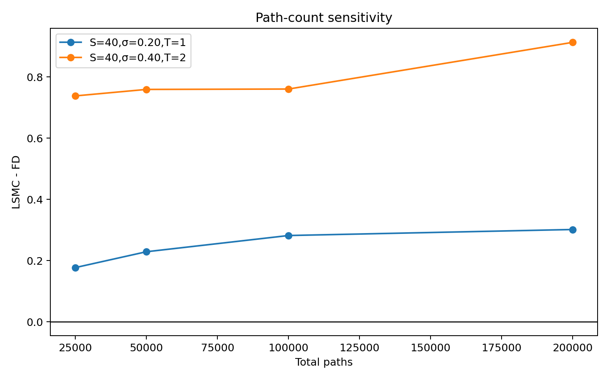
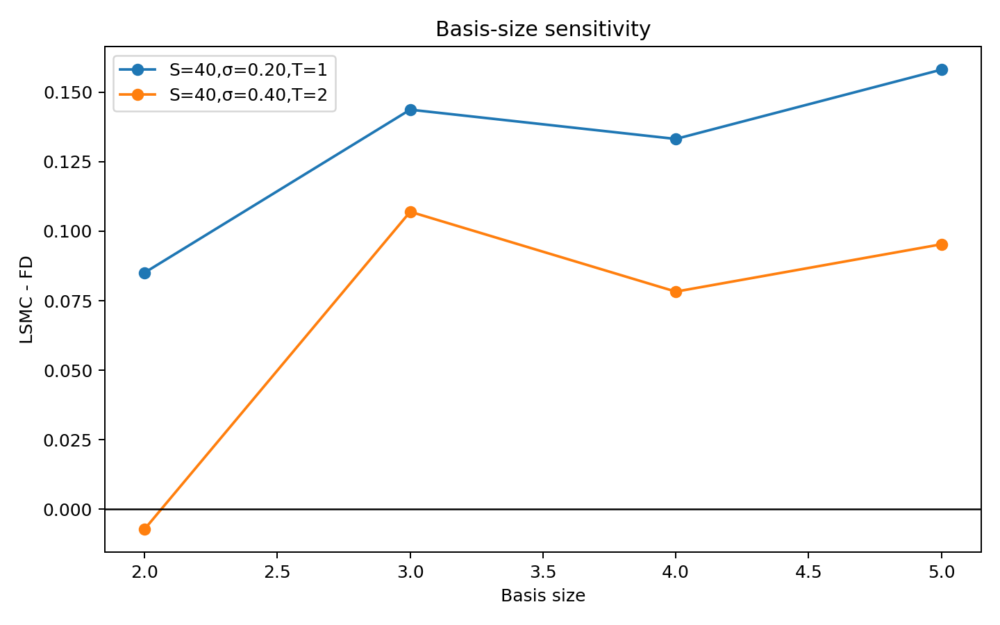
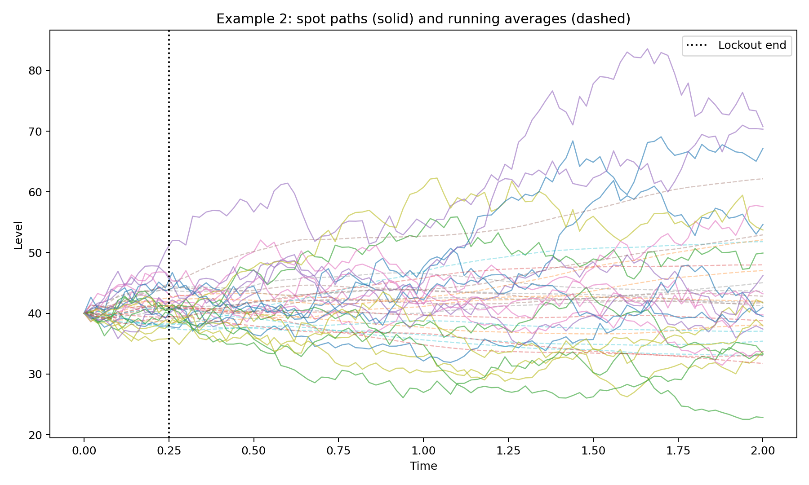

## Introduction

American-style derivatives are more difficult to value than their European counterparts because the holder may exercise before maturity. The pricing problem is therefore not simply the evaluation of a terminal payoff, but an optimal stopping problem under the risk-neutral measure. Even for a vanilla American put, the value depends on the entire exercise policy through time rather than only on the terminal distribution of the underlying asset.

This project studies that problem through two influential regression-based papers: Longstaff and Schwartz (2001), which introduced the least-squares Monte Carlo (LSMC) method in a highly practical form, and Tsitsiklis and Van Roy (2001), which framed related regression ideas through approximate dynamic programming. The main implementation anchor of the project is the Longstaff paper. The Tsitsiklis--Van Roy paper is retained as an important conceptual comparator, but not as the main empirical validation track.

The revised project is centered on a synthetic, paper-style benchmark rather than on historical equity data. This is the appropriate anchor for a study of Longstaff--Schwartz because the paper's contribution is a valuation algorithm under a controlled stochastic model, not a historical-data forecasting exercise. Accordingly, the main numerical study uses a non-dividend-paying stock under risk-neutral geometric Brownian motion (GBM), weighted Laguerre basis functions, antithetic variates, and a direct American benchmark from an implicit finite-difference solver. The project then extends the same LSM framework to a compact Asian-style multi-state example and to a jump-to-ruin example showing that the regression/backward-induction engine is not tied to standard GBM alone.

The report is framed honestly. It is a study of the papers and their workflow, supported by a compact computational realization and numerical evidence. It does not claim an exact line-by-line reproduction of every example in Longstaff and Schwartz (2001), nor does it claim a full theoretical or computational reproduction of Tsitsiklis and Van Roy (2001). The objective is instead to present the mathematical context, the algorithmic ideas, the implemented workflow, the test results, and the limitations in a coherent course-project format.

## Problem setup: American option pricing as an optimal stopping problem

Consider an American put with strike $K$ and maturity $T$ written on an underlying price process $(S_t)_{0 \le t \le T}$. Under no-arbitrage pricing, its time-zero value under the risk-neutral measure $\mathbb{Q}$ is

$$
V_0 = \sup_{\tau \in \mathcal{T}} \mathbb{E}^{\mathbb{Q}}\left[e^{-r\tau}(K-S_\tau)^+\right],
$$

where $r$ is the continuously compounded risk-free rate and $\mathcal{T}$ is the set of admissible stopping times. The holder chooses an exercise time $\tau$ to maximize the expected discounted payoff. This is the core distinction from a European put, whose exercise time is fixed at maturity.

In a discrete-time approximation with exercise dates $0=t_0<t_1<\cdots<t_N=T$, the Bellman recursion is

$$
V_i(S_{t_i}) = \max\left\{ h(S_{t_i}),\; C_i(S_{t_i}) \right\},
$$

where the intrinsic payoff is

$$
h(S_{t_i}) = (K-S_{t_i})^+,
$$

and the continuation value is

$$
C_i(S_{t_i}) = \mathbb{E}^{\mathbb{Q}}\left[e^{-r\Delta t}V_{i+1}(S_{t_{i+1}}) \mid S_{t_i}\right].
$$

Thus, pricing amounts to comparing immediate exercise with the value of waiting. For a one-dimensional vanilla contract, this recursion can be handled directly by trees or partial differential equation methods. The challenge that motivated the Longstaff and Tsitsiklis--Van Roy papers is that such direct state-space methods become awkward when the problem is high-dimensional, path-dependent, or otherwise difficult to grid.

## Risk-neutral model and benchmark pricing framework

The main implementation uses a standard Black--Scholes style GBM model under the risk-neutral measure:

$$
dS_t = rS_t\,dt + \sigma S_t\,dW_t^{\mathbb{Q}},
$$

with constant volatility $\sigma$ and no dividends. Over a discrete time step $\Delta t$, the simulated dynamics are

$$
S_{t+\Delta t} = S_t \exp\left(\left(r-\tfrac12\sigma^2\right)\Delta t + \sigma\sqrt{\Delta t}Z\right), \qquad Z\sim N(0,1).
$$

The anchor benchmark is deliberately synthetic and follows the paper-oriented configuration used in the implemented code:

- strike $K=40$;
- risk-free rate $r=0.06$;
- spot values $S_0 \in \{36,38,40,42,44\}$;
- volatilities $\sigma \in \{0.20,0.40\}$;
- maturities $T \in \{1,2\}$;
- 50 exercise dates per year;
- 100,000 paths in total, constructed as 50,000 base paths and 50,000 antithetic counterparts.

This synthetic benchmark is the correct anchor for the Longstaff study because it isolates the regression-based pricing problem itself. Historical AAPL data may be useful in a different project context, but they are not the right primary validation device for a paper whose central contribution is a simulation-and-regression algorithm under a stylized model.

Three benchmark layers are used in the report. First, the European reference is the Black--Scholes put value,

$$
P_{\text{Euro}} = Ke^{-rT}N(-d_2) - S_0N(-d_1),
$$

with the standard definitions of $d_1$ and $d_2$. Second, the primary direct American benchmark for the vanilla put is an implicit finite-difference solver under the same GBM assumptions. This is the main ground-truth benchmark because it solves the American early-exercise problem directly in a one-dimensional setting. Third, a Cox--Ross--Rubinstein binomial tree is included as an additional sanity check. The finite-difference benchmark is the primary benchmark reported in the core table.

## Longstaff--Schwartz (2001): paper walkthrough and intuition

Longstaff and Schwartz (2001) solve the central Monte Carlo obstacle in American option pricing: simulation naturally handles terminal expected values, but American pricing requires conditional continuation values and stopping decisions at intermediate dates. A naive forward Monte Carlo procedure does not directly supply the conditional expectation needed for the continuation value.

The core idea is to approximate the continuation value by regression on simulated paths. Working backward from maturity, one uses realized future discounted cash flows as regression targets and fits them as functions of the current state. At a generic exercise date $t_i$, the continuation value is approximated by

$$
C_i(S_{t_i}) \approx \hat{C}_i(S_{t_i}) = \sum_{j=0}^{m}\beta_{i,j}\psi_j(S_{t_i}),
$$

where $\{\psi_j\}$ is a chosen family of basis functions. In the present implementation, the vanilla benchmark uses the constant plus the first three weighted Laguerre polynomials, which is consistent with the usual Longstaff--Schwartz style.

The algorithm can be summarized as follows.

1. Simulate risk-neutral paths of the underlying state variables.
2. At maturity, set the cash flow equal to the terminal option payoff.
3. Move backward through the exercise dates.
4. For paths that are currently in the money, regress discounted realized continuation cash flows on basis functions of the current state.
5. Exercise if the intrinsic value exceeds the fitted continuation value; otherwise continue.
6. Discount the resulting realized cash flows back to time zero and average across paths.

The paper's practical importance lies in its flexibility. The method does not require gridding the full state space. Instead, it estimates the continuation rule from the pathwise cross section. That is why LSMC became a foundational practical technique for pricing American-style derivatives when the state dimension or path structure makes direct lattice or PDE methods less attractive.

The present project follows this workflow closely in spirit, but not as an exact numerical reproduction of every example in the paper. The vanilla benchmark is deliberately controlled and transparent, and the extensions are compact realizations meant to illustrate the paper's broader message rather than to claim exact duplication of every published table.

## Tsitsiklis--Van Roy (2001): paper walkthrough and intuition

Tsitsiklis and Van Roy (2001) study American-style option pricing from the perspective of approximate dynamic programming. Rather than focusing primarily on local exercise classification, they frame the problem as recursive approximation of the value function itself. Their paper is therefore conceptually important because it explains regression-based option pricing as a form of approximate value iteration.

In discrete time, the Bellman recursion is

$$
V_i(s) = \max\left\{ h(s),\; \mathbb{E}^{\mathbb{Q}}\left[e^{-r\Delta t}V_{i+1}(S_{t_{i+1}}) \mid S_{t_i}=s\right] \right\}.
$$

The TVR viewpoint approximates the continuation term by projecting it onto a finite-dimensional function class,

$$
\hat{C}_i(s) = \sum_{j=0}^{m}\alpha_{i,j}\phi_j(s),
$$

and then updates the value approximation through

$$
\hat{V}_i(s) = \max\{h(s),\hat{C}_i(s)\}.
$$

Conceptually, this differs from Longstaff--Schwartz in two main ways. First, the TVR perspective is more explicitly value-function oriented. Second, implementations in that style often use a broader regression sample rather than restricting attention only to ITM states. The paper is therefore important not only because of its computational proposal, but also because it clarifies how approximation error and representative state sampling interact in regression-based dynamic programming.

For the purposes of this project, the TVR paper remains an important conceptual comparator. However, the current report does not treat it as the main empirical implementation track. The Longstaff workflow is the practical center of the project, and the TVR paper is retained mainly as a conceptual and methodological foil.

## Conceptual comparison of the two papers

The two papers are closely related but should not be treated as interchangeable. Longstaff and Schwartz (2001) provide a highly practical algorithm for approximating continuation values and exercise decisions directly from simulated cash flows. Tsitsiklis and Van Roy (2001) provide a broader approximate dynamic-programming interpretation of the same class of problems.

For the present project, Longstaff--Schwartz is the operational anchor because it is directly implemented in modular form and tested against a direct American benchmark. Tsitsiklis--Van Roy remains useful because it places regression-based American pricing in a wider theoretical context. The appropriate project framing is therefore:

- **Longstaff--Schwartz:** main implementation and main empirical study;
- **Tsitsiklis--Van Roy:** conceptual comparator paper, largely retained as background and interpretation.

## Longstaff implementation workflow and code design

The revised implementation is organized under `src/LongstaffMethod` and is structured to separate basis construction, simulation, generic backward induction, and benchmarking.

The file `basis.py` defines the weighted Laguerre basis used in the vanilla benchmark and the compact multi-state basis used in the Asian extension. For the vanilla put, the implemented basis is the constant plus the first three weighted Laguerre terms in normalized spot $S_t/K$. For the Asian extension, the basis expands to functions of both current spot and running arithmetic average, including cross terms.

The file `simulators.py` contains the model-side path generation logic. It includes a GBM path generator with antithetic variates, a GBM-plus-running-average simulator for the Asian-style example, and a jump-to-ruin simulator for the jump example. This separation is important because it demonstrates one of the paper's key practical advantages: once the backward-induction engine is generic, the model dynamics can be changed without rewriting the entire pricing algorithm.

The file `lsm_engine.py` implements the generic Longstaff--Schwartz backward-induction engine. It accepts state paths, a payoff function, a basis builder, an exercise-eligibility mask, and discounting inputs. It returns a price estimate, Monte Carlo standard error, stopping-time information, regression-step summaries, and empirical exercise-boundary summaries. The same engine is reused for the vanilla benchmark, the Asian multi-state extension, and the jump example.

The file `benchmarks.py` contains the closed-form Black--Scholes European put price, the implicit finite-difference American put benchmark, and an optional Cox--Ross--Rubinstein binomial tree. The finite-difference benchmark is the primary direct American comparator for the vanilla put because it is the most appropriate one-dimensional benchmark under the imposed GBM assumptions.

The file `run_longstaff_vanilla.py` is the main driver for the synthetic benchmark and robustness studies. It constructs the parameter grid, writes the main results table to `outputs/longstaff_vanilla_benchmark.csv`, generates the robustness tables, and creates the vanilla visuals. The current version uses a two-pass design for the main benchmark: it fits the continuation rule on one path set and evaluates that stopping rule on an independent path set. This revision was introduced after diagnosing that same-path regression and same-path valuation produced materially optimistic in-sample values.

The file `run_longstaff_asian.py` implements a compact Example 2 style extension in which the state vector contains current spot and running arithmetic average, and exercise is prohibited before a lockout time. The file `run_longstaff_jump.py` implements a compact Example 4 style extension in which the stock follows a jump-to-ruin process. Together, these scripts show that the code architecture is modular with respect to both state dimension and path model.

## Experimental design

The numerical study is organized around five layers.

First, the anchor benchmark is the vanilla American put under risk-neutral GBM on the synthetic grid described earlier. The basis functions are the constant plus the first three weighted Laguerre polynomials. Antithetic variates are used in the GBM generator to reduce Monte Carlo variance.

Second, the direct benchmark layer compares the LSMC output to the European Black--Scholes price, the implicit finite-difference American price, and an optional CRR tree value. The finite-difference benchmark is the primary reference because it addresses the same American stopping problem directly.

Third, robustness and validation are tested through five diagnostics: in-sample versus out-of-sample stopping-rule valuation, path-count sensitivity, exercise-frequency sensitivity, basis-size sensitivity, and seed sensitivity. These diagnostics are not cosmetic additions; they are central to understanding how stable the regression-based procedure is and whether the reported values are being inflated by in-sample fitting effects.

Fourth, a compact Asian-style extension is used to demonstrate regression on multiple state variables. The state contains both spot and running arithmetic average, exercise is only permitted after a lockout period, and the payoff depends on the average rather than spot alone. The purpose is not to claim an exact replication of every numerical detail in the paper, but to demonstrate the key methodological point that the regression can be generalized to a richer state.

Fifth, a compact jump-to-ruin extension is used to demonstrate that the LSM engine is not specific to standard Brownian motion. In that experiment, the simulator changes while the regression/backward-induction logic remains the same.

## Results

### Vanilla benchmark comparison

The central benchmark table is shown below.

```{python}
import pandas as pd
vanilla = pd.read_csv('../outputs/longstaff_vanilla_benchmark.csv')
vanilla[[
    'spot','sigma','maturity','european_put_bs','american_put_fd',
    'american_put_lsmc','lsmc_stderr','lsmc_fit_minus_eval',
    'lsmc_premium_minus_fd_premium'
]].round(4)
```

The synthetic vanilla benchmark supports several clear conclusions. First, all American values exceed the corresponding European prices, as expected. Second, the finite-difference benchmark and the CRR tree are close to one another across the grid, which supports the use of the finite-difference solver as the main direct reference. Third, the LSMC values are of the right order of magnitude throughout the grid, but they do not coincide exactly with the finite-difference benchmark. Some cases remain above the finite-difference value, while others fall below it.

The most important interpretive point is that the current benchmark is deliberately reported using a two-pass policy design. The table therefore distinguishes the fitted in-sample policy value from the evaluated out-of-sample benchmark price. The column `lsmc_fit_minus_eval` captures the amount by which same-path fitting would have overstated the benchmark case had that in-sample value been reported as the final price. In the higher-volatility and longer-maturity cases, this gap is material. This is a useful finding rather than an embarrassment: it shows why careful validation matters in simulation-based optimal stopping.

Figure 1 plots the vanilla benchmark comparison.


The figure shows that the revised two-pass LSMC estimates track the finite-difference benchmark much more tightly than the earlier same-path values did. The alignment is not exact, and the report does not claim otherwise. However, the resulting benchmark is far more honest and methodologically defensible.

### Exercise-boundary interpretation

The project also records empirical exercise-boundary summaries from the LSM procedure.


This figure should be interpreted as an empirical summary of exercise behavior rather than as an analytically exact free boundary. It is generated from the states on which the algorithm exercises along simulated paths. The boundary remains time-dependent and economically sensible: early exercise is associated with lower stock-price regions, and the location of the exercise region varies across volatility and maturity cases. The figure is useful because it shows that the LSMC implementation produces not only price estimates but also an interpretable stopping policy.

### Robustness checks

The in-sample versus out-of-sample diagnostic is reported below for representative cases.

```{python}
inout = pd.read_csv('../outputs/longstaff_vanilla_in_vs_out_sample.csv')
inout.round(4)
```

These results are one of the most informative parts of the project. In every representative case, the in-sample policy value is above the out-of-sample value. That is exactly the pattern expected if same-path fitting and valuation produce optimistic estimates. The gap is modest in the easier one-year, lower-volatility cases, and much larger in the longer-maturity, higher-volatility case. This diagnostic explains why the vanilla benchmark was revised to use two-pass pricing.

Path-count sensitivity is shown in Figure 2 and the corresponding table.

```{python}
paths = pd.read_csv('../outputs/longstaff_vanilla_paths_sensitivity.csv')
paths.round(4)
```



The path-count study suggests that Monte Carlo standard errors shrink as expected when the path count rises, but price alignment with the finite-difference benchmark does not improve monotonically in every case. That is not surprising: regression bias, basis error, and pathwise exercise classification interact with sampling variation in a nontrivial way.

Basis-size sensitivity is summarized below and in Figure 3.

```{python}
basis = pd.read_csv('../outputs/longstaff_vanilla_basis_sensitivity.csv')
basis.round(4)
```



The basis study shows that increasing the number of basis functions does not automatically improve results. In some cases, a smaller basis performs more stably relative to the benchmark. This is consistent with the general lesson of regression-based dynamic programming: more basis functions can reduce approximation bias in principle, but may also introduce instability or overfitting in finite samples.

Additional robustness tables for time-step sensitivity and seed sensitivity are included below.

```{python}
timestep = pd.read_csv('../outputs/longstaff_vanilla_timestep_sensitivity.csv')
timestep.round(4)
```

```{python}
seed = pd.read_csv('../outputs/longstaff_vanilla_seed_sensitivity.csv')
seed.round(4)
```

The exercise-frequency sensitivity confirms that the valuation can shift noticeably when the number of exercise dates changes, especially in more difficult cases. The seed-sensitivity study shows that the revised benchmark is reproducible in a meaningful sense, but still exhibits non-negligible pathwise variation across repeated runs. These are exactly the kinds of diagnostics that should accompany a regression-based American pricing engine.

### Asian extension interpretation

The compact Asian-style extension is summarized below.

```{python}
asian = pd.read_csv('../outputs/longstaff_asian_results.csv')
asian.round(4)
```




This extension is designed to demonstrate the core methodological point of Example 2: the continuation regression can depend on multiple state variables. Here the state vector includes current spot and running arithmetic average, and exercise is prohibited before a lockout period. The payoff is based on the average rather than spot alone. The result is therefore not just a new payoff formula, but a genuinely richer regression problem.

The report does not overclaim the Asian example. No direct PDE benchmark is provided for this case, and the code explicitly states that the direct benchmark emphasis is concentrated on the vanilla put. The correct interpretation is that this is a compact Asian-style realization that captures the paper's multi-state regression idea without claiming exact numerical replication of every published example.

### Jump extension interpretation

The jump-to-ruin experiment is summarized below.

```{python}
jump = pd.read_csv('../outputs/longstaff_jump_results.csv')
jump.round(4)
```


This experiment demonstrates the modularity of the LSM architecture. The backward-induction logic is the same as in the vanilla case; only the simulator changes. Under jump-to-ruin dynamics, the American and European put values are much higher because the stock can collapse to zero before maturity. The experiment therefore serves its intended conceptual purpose: it shows that the LSM engine is not tied to standard Brownian motion, but can be reused with a different path model.

## Implementation and testing

The revised implementation section is intentionally separate from the results section because the project rubric requires clear discussion of both code structure and validation methodology.

The first important testing principle is that the Black--Scholes European price is only a partial reference. It provides a lower bound for the American contract, but it is not a direct benchmark for the early-exercise problem. That is why the finite-difference American put price is the primary benchmark in the vanilla study.

The second important testing principle is that same-path valuation is not enough. A regression-based stopping rule can appear too strong when it is fitted and valued on the same path set. The current project therefore includes the explicit in-sample versus out-of-sample diagnostic and uses a two-pass policy valuation in the main benchmark workflow. This revision was motivated by the observed same-path optimism in the original synthetic benchmark results.

The third principle is that robustness is multidimensional. Path count, exercise frequency, basis size, and random seed all matter. The report does not claim that the current implementation is fully converged in every respect; rather, it presents the robustness tables as evidence of how the method behaves under controlled perturbations of the numerical design.

The fourth principle is that different examples require different benchmark ambitions. For the vanilla American put, a direct PDE benchmark is practical and therefore should be used. For the Asian extension, the report is explicit that no direct PDE benchmark was implemented in this compact project. This is a limitation, but it is an honest and acceptable one if stated clearly.

## Critical assessment

The project captures several important strengths of Longstaff--Schwartz style regression-based Monte Carlo. It provides a practical solution to the continuation-value problem in American pricing, scales naturally beyond low-dimensional grids, and can be adapted to richer state vectors and nonstandard dynamics. The Asian and jump examples show exactly why that flexibility matters. Once the generic backward-induction engine is in place, the same basic logic can be reused across materially different contracts and state models.

The project also captures a genuinely important methodological lesson: regression-based Monte Carlo needs careful validation. The revised vanilla study shows that in-sample pricing can be materially optimistic. This is not a minor implementation detail; it goes to the heart of model governance. In a practical setting, failure to benchmark the stopping rule honestly could lead to persistent overvaluation.

Several limitations remain. The finite-difference benchmark is a compact one-dimensional implementation rather than a production PDE library. The Asian example is not accompanied by a direct benchmark. The jump-to-ruin model is a compact discrete-time realization rather than a full structural jump-diffusion model. Some LSMC values remain above the finite-difference benchmark, while others undershoot it. These are not concealed because they are part of the real numerical story of the method.

From an institutional perspective, several risks would arise if methods like these were used carelessly: basis misspecification, unstable regressions in sparse ITM regions, error propagation through backward induction, and overreliance on in-sample performance. The current project is therefore best interpreted not as a production pricing library, but as a study of the papers with computational evidence and an honest assessment of the numerical behavior.

## Honest project framing

This report should be understood as a study of the Longstaff and Tsitsiklis--Van Roy papers supported by a compact computational implementation. It is not a claim of exact line-by-line reproduction of every table in either paper. The vanilla synthetic benchmark is close to the paper's spirit and workflow: risk-neutral GBM, regression on weighted Laguerre functions, backward induction, and direct benchmarking against a one-dimensional American solver. The Asian and jump examples are compact realizations intended to demonstrate the broader reach of the method, not to serve as exhaustive reproductions.

This framing strengthens the report because it aligns the claims with the actual code, outputs, and numerical evidence. The project therefore satisfies the course objective more credibly by combining mathematical explanation, paper interpretation, implementation detail, testing, and critical assessment without overclaiming beyond what was actually built.

## Conclusion

The project studies American option pricing as an optimal stopping problem and uses Longstaff--Schwartz least-squares Monte Carlo as the main implementation framework. The revised report centers the empirical study on a synthetic, paper-style vanilla American put benchmark under risk-neutral GBM, benchmarked directly against an implicit finite-difference solver and supported by European and CRR references. This is the appropriate validation anchor for a study of Longstaff and Schwartz (2001).

The numerical evidence shows that the compact implementation behaves reasonably, but not perfectly. The revised two-pass benchmark tightens the LSMC values relative to the direct benchmark and reveals that same-path valuation was materially optimistic in some cases. The robustness tables show that path count, exercise frequency, basis size, and seed all affect the output in meaningful ways. The Asian extension demonstrates multi-state regression, and the jump-to-ruin extension demonstrates that the LSM engine is modular with respect to the path model.

Overall, the report supports two conclusions. First, Longstaff--Schwartz remains a practically important and conceptually elegant approach to American pricing. Second, implementation details and validation design matter enormously. In that sense, the project succeeds not only as a paper study, but also as a demonstration of why careful computational benchmarking is essential in quantitative finance.

## Reproducibility / code execution

The revised Longstaff workflow is executed from the project root using the scripts under `src/LongstaffMethod`.

A typical workflow is:

```bash
python src/LongstaffMethod/run_longstaff_vanilla.py
python src/LongstaffMethod/run_longstaff_asian.py
python src/LongstaffMethod/run_longstaff_jump.py
```

The main numerical outputs are written to `outputs/`, configuration snapshots to `data/`, and visuals to `visuals/`. The review log discussing the vanilla bias revision is stored in `SupportFiles/longstaff_vanilla_bias_fix_log.txt`.

The report can then be rendered using Quarto:

```bash
quarto render report/american_options_lsmc_study.qmd --to pdf
```

If PDF rendering is unavailable, HTML can be generated instead:

```bash
quarto render report/american_options_lsmc_study.qmd --to html
```

Because the project is now synthetic rather than dependent on live market downloads for the main benchmark, rerunning the Longstaff scripts should reproduce the same design and closely similar Monte Carlo outputs, up to the documented randomness induced by the chosen seeds and numerical approximations.

## References

Longstaff, F. A., & Schwartz, E. S. (2001). Valuing American options by simulation: A simple least-squares approach. *The Review of Financial Studies*, 14(1), 113--147.

Tsitsiklis, J. N., & Van Roy, B. (2001). Regression methods for pricing complex American-style options. *IEEE Transactions on Neural Networks*, 12(4), 694--703.
