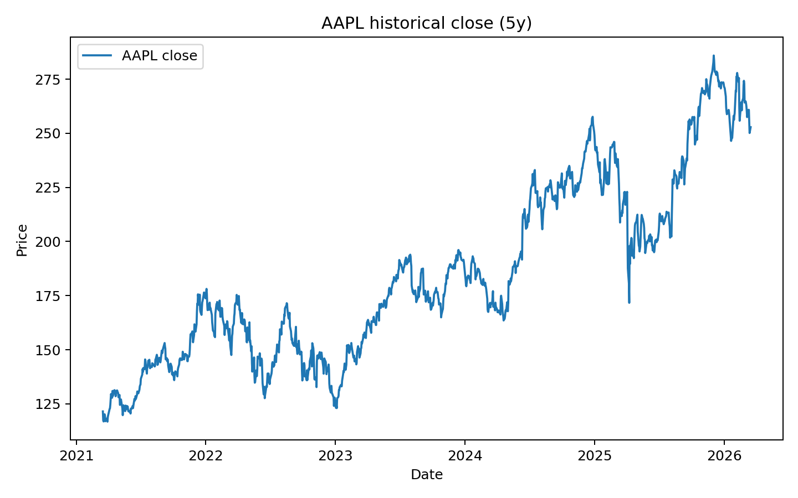
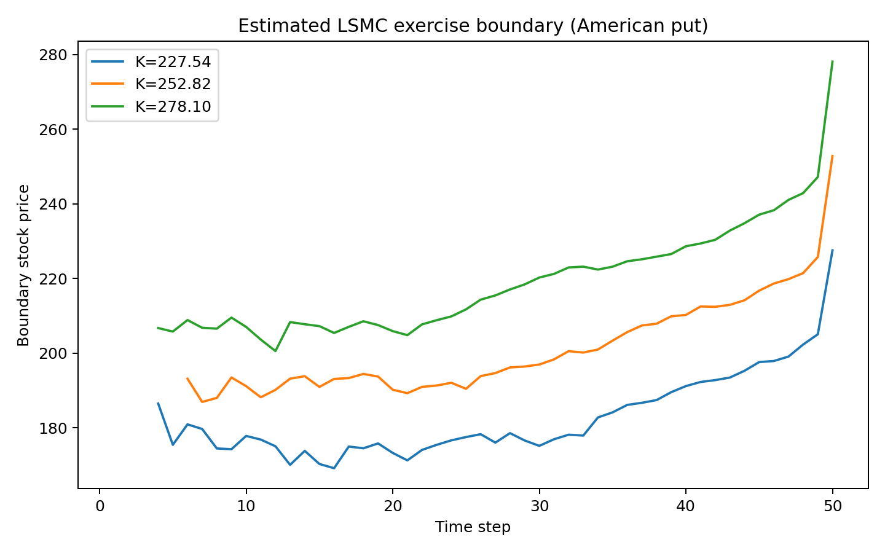
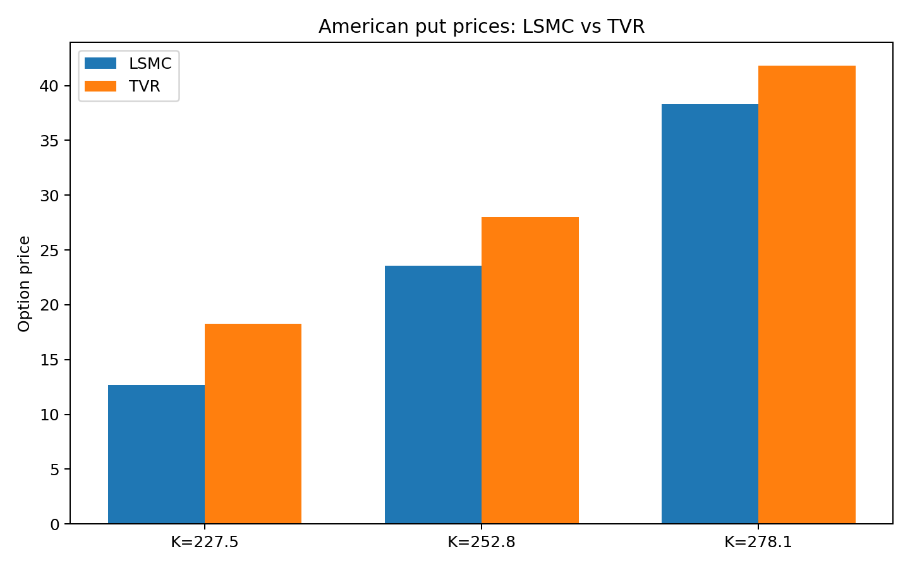

## 1. Financial context and relevance

American options can be exercised at any time up to maturity, so pricing them is an **optimal stopping** problem under the risk-neutral measure. For vanilla American puts, early exercise can be rational (especially deep in-the-money and with positive rates). For high-dimensional payoffs (basket options, path dependence, multifactor models), lattice/PDE methods become expensive or intractable, making simulation-based methods essential.

The 2001 Longstaff-Schwartz paper introduced a practical simulation approach (Least-Squares Monte Carlo, LSMC) that estimates continuation values via cross-sectional regressions and then applies backward dynamic programming. This became one of the most influential methods in buy-side/sell-side derivatives libraries.

## 2. Primary and extension papers

### Primary paper
- Longstaff, F. A., & Schwartz, E. S. (2001). *Valuing American Options by Simulation: A Simple Least-Squares Approach*. The Review of Financial Studies.
- URL: <https://galton.uchicago.edu/~mykland/346W07/Longstaff.pdf>

### Related/extended paper
- Tsitsiklis, J. N., & Van Roy, B. (2001). *Regression Methods for Pricing Complex American-Style Options*. IEEE Transactions on Neural Networks.
- URL: <https://www.mit.edu/~jnt/Papers/J086-01-bvr-options.pdf>

## 3. Methodology implemented

### 3.1 Longstaff-Schwartz (LSMC)

For each simulated path and time step (going backward):

### 3.1 Longstaff-Schwartz (LSMC)

American options are more difficult to price than European options because the holder may exercise before maturity. This early-exercise feature turns valuation into an optimal stopping problem. At each exercise date, the holder must compare the value of immediate exercise with the value of continuation, that is, the expected discounted payoff from keeping the option alive. For simple contracts, tree and PDE methods can be used, but these approaches become much less convenient in higher-dimensional or path-dependent settings. This is one of the main motivations for simulation-based pricing methods.

The Longstaff-Schwartz least-squares Monte Carlo (LSMC) method combines Monte Carlo simulation with regression in order to approximate the continuation value. The key idea is that the continuation value is not directly observable during simulation, so it is estimated statistically from simulated future cash flows. For an American put, the immediate exercise value at time \(t\) is the intrinsic value
\[
(K - S_t)^+.
\]
The continuation value can be written as the conditional expectation of discounted future payoffs:
\[
C(S_t) = \mathbb{E}[e^{-r\Delta t}V_{t+1} \mid S_t].
\]
LSMC approximates this conditional expectation by regressing discounted realized future cash flows on basis functions of the current state variable.

The algorithm starts by simulating a large number of stock-price paths under the risk-neutral dynamics. At maturity, the option value is simply the terminal payoff. The method then proceeds backward in time. At each earlier exercise date, the discounted future cash flows from continuation are regressed on a chosen set of basis functions, and the fitted value is interpreted as the continuation-value estimate. The holder is assumed to exercise whenever the immediate exercise payoff exceeds this estimated continuation value; otherwise, the option is continued. Repeating this backward recursion across all exercise dates produces both an estimated option value and an approximate exercise strategy.

A practical feature of the Longstaff-Schwartz method is that the regression is usually restricted to in-the-money paths. The reason is that when the option is out of the money, immediate exercise is irrelevant, so those paths provide little useful information about the stopping decision. Restricting the regression to in-the-money paths often improves numerical stability and reduces noise. However, it can also create sensitivity when the number of in-the-money paths becomes small, especially in sparse regions or early in the simulation horizon.

In our implementation, we apply LSMC to price an American put option under a geometric Brownian motion model. The initial stock price is based on recent AAPL data, the volatility is estimated from five years of historical log returns, and the short rate is approximated using the \(^IRX\) yield as a simple proxy. We simulate risk-neutral stock-price paths, compute intrinsic values, estimate continuation values using Laguerre basis functions on in-the-money paths, and apply backward induction to obtain both the option price and the estimated early exercise boundary.

### 3.2 Tsitsiklis-Van Roy style regression DP (extension)

This variant performs fitted value iteration with regression of discounted next-step value onto basis functions (using all paths). It is conceptually close to approximate dynamic programming and provides a useful comparison against classical in-the-money LSMC regression.

## 4. Data and experimental setup

- Underlying: `AAPL`
- Data source: Yahoo Finance (`yfinance`)
- Spot from latest close, volatility from annualized daily log-return std over 5 years
- Risk-free proxy: latest 13-week T-bill index (`^IRX`) / 100
- Maturity: 1 year
- Time grid: 50 time steps
- Monte Carlo paths: 100,000
- Strikes: $0.9S_0$, $1.0S_0$, $1.1S_0$

## 5. Python implementation and project structure

- `data/` : raw/derived data (`aapl_prices.csv`, `pricing_results.csv`)
- `src/` : implementation scripts (`lsmc.py`, `tsitsiklis_vanroy.py`, `data_loader.py`, `run_study.py`)
- `visuals/` : generated plots
- `report/` : this QMD report

## 6. Results

```{python}
import pandas as pd
results = pd.read_csv('../data/pricing_results.csv')
results
```

A quick consistency check is that American put values should be at least as large as corresponding European put values (same model inputs); this holds in the generated output.

```{python}
(results[['strike','european_put_bs','lsmc_price','tvr_price']])
```

### Visuals







## 7. Critical evaluation

### Strengths of LSMC / regression simulation methods

- Scales better than trees/PDE in high dimensions.
- Flexible: supports path-dependent state variables and custom payoff logic.
- Natural fit for enterprise Monte Carlo risk stacks.
- Easy to parallelize.

### Weaknesses / limitations

- **Basis risk / approximation error**: poor basis choice biases continuation estimates.
- **Look-ahead and finite-sample bias** risk if implementation is careless.
- **Exercise boundary instability** in sparse ITM regions.
- **Model risk**: under realistic markets, GBM with constant volatility/rates is often insufficient.
- **Tail events** underrepresented in standard MC unless variance reduction / stress design is used.

### Does this address real-world needs appropriately?

Partly yes. LSMC is practically valuable and remains widely used. But institutions using it naively (simple GBM, fixed polynomial basis, weak diagnostics) may systematically misprice early-exercise features and risk exposures, especially in stressed regimes or products with complex state dependence.

### Where institutions can run into trouble

- Underfitting continuation values for deep OTM/ITM states.
- Overfitting with high-order basis and limited effective sample.
- Unstable Greeks due to regression noise.
- Governance gaps: insufficient backtesting against benchmarks and market quotes.

### Suggestions for improvement

1. **Richer dynamics**: local/stochastic volatility, stochastic rates, jumps when needed.
2. **Regularized / adaptive regression**: orthogonalized basis, cross-validation, or modern ML regressors with strong controls.
3. **Variance reduction**: antithetic/control variates, quasi-MC.
4. **Dual bounds** (e.g., Andersen-Broadie style) to quantify pricing bias intervals.
5. **Robust model validation**: benchmark against lattice/PDE in low dimensions, scenario stress testing, and out-of-sample stability checks.

## 8. Reproducibility

From project root:

```bash
python -m pip install yfinance pandas numpy matplotlib
python src/run_study.py
quarto render report/american_options_lsmc_study.qmd --to pdf
```

If PDF rendering tools are unavailable, render to HTML as fallback:

```bash
quarto render report/american_options_lsmc_study.qmd --to html
```
